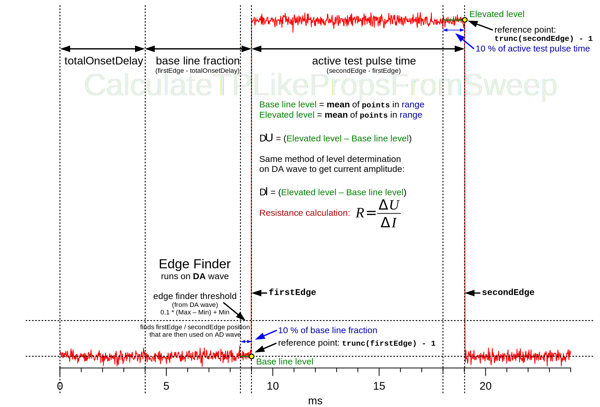

 .. _CalculateTPLikePropsFromSweep_doc:

CalculateTPLikePropsFromSweep Algorithm
---------------------------------------

Description
===========

The :cpp:func:`CalculateTPLikePropsFromSweep` calculates square pulse properties
from a given sweep. It retrieves the associated setting values for the sweep and
returns the voltage difference, current difference and resistance for each
head stage. The function only works for current clamp mode.

The function is split into several parts:

 - `Principle`_
 - `Retrieving settings`_
 - `Finding square pulse`_
 - `Extraction of levels`_
 - `Calculation`_

Principle
=========

The goal of the algorithm is to determine the steady state resistance of a
square pulse response. The available sweep data contains the excitation pulse as
well as the response pulse. The excitation pulse is in units of current and the
response is measured in voltage. The actual data consists of discrete points of
digital to analog output (excitation) and analog to digital input (response).
For simplicity this will be neglected in the following.

The square pulse DA data is used to find the leading and trailing edge of
the pulse. Therefore a level of 10% of the amplitude of the square pulse is defined
to find the location of signal crossing.

.. math::
   level = minimum + (maximum - minimum) * 0.1

Using a edge finding algorithm the location of **firstEdge** and **secondEdge**
is retrieved.

For determination of the base line level in front of the pulse a
range is defined to average the points of the square pulse response. The full base
line fraction in front of a square pulse starts after the ``onSetDelay`` and ends
at ``firstEdge``. The length of the range is defined as 10% of this distance. The
reference point is the end of this range and it is set close to firstEdge.

.. math::
   right &= firstEdge - const \\
   left &= right - (firstEdge - onSetDelay) * 0.1

The base line level is then determined by averaging over the data points **p** between
**left** and **right**.

.. math::
   baselinelevel = \frac{1}{N} \sum^{right}_{n=left} p_n

For determination of the elevated level at the end of the active pulse a
range is defined to average the points of the square pulse response. The active
pulse starts after ``firstEdge`` and ends with ``secondEdge``. The length of the
range is defined as 10% of this distance. The reference point is the end of this
range and it is set close to secondEdge.

.. math::
   right &= secondEdge - const \\
   left &= right - (secondEdge - firstEdge) * 0.1

The elevated level is then determined by averaging over the data points **p** between
**left** and **right**.

.. math::
   elevatedlevel = \frac{1}{N} \sum^{right}_{n=left} p_n

The difference between elevated level and base line level is the voltage response
for the steady state.

.. math::
   \Delta U = elevatedlevel - baselinelevel

To get the steady state resistance the current from the excitation amplitude of
the square pulse is required. It is retrieved the same way from the square pulse
excitation data as the voltage response from the square pulse response data.
The difference from the square pulse excitation data yields:

.. math::
   \Delta I = elevatedlevel - baselinelevel

The steady state resistance is then:

.. math::
   R_{SS} = \frac{\Delta U}{\Delta I}

Retrieving settings
===================

The sweep number is retrieved, that allows to get the setting for this sweep.
Also the configuration wave for the sweep is retrieved, that is required to
extract the actual ADC and DAC data from the sweep.

The ``totalOnsetDelay`` is independent of the head stage and the sum of the auto and
user onset delay. The number of the ADC channel that are used per head stage
is read to wave ``ADCs``. The same is done for the number of the DAC channel to the wave ``DACs``.
The units per head stage are read from the saved settings to wave ``ADunit`` and
wave ``DAunit``. If a head stage was active is read to the wave wave ``statusHS``.

.. code-block:: igorpro

   sweepNo     = ExtractSweepNumber(NameofWave(sweep))
   WAVE config = GetConfigWave(sweep)

   totalOnsetDelay = GetLastSettingIndep(numericalValues, sweepNo, "Delay onset auto", DATA_ACQUISITION_MODE) + \
             GetLastSettingIndep(numericalValues, sweepNo, "Delay onset user", DATA_ACQUISITION_MODE)

   WAVE ADCs = GetLastSetting(numericalValues, sweepNo, "ADC", DATA_ACQUISITION_MODE)
   WAVE DACs = GetLastSetting(numericalValues, sweepNo, "DAC", DATA_ACQUISITION_MODE)

   WAVE/T ADunit = GetLastSetting(textualValues, sweepNo, "AD Unit", DATA_ACQUISITION_MODE)
   WAVE/T DAunit = GetLastSetting(textualValues, sweepNo, "DA Unit", DATA_ACQUISITION_MODE)

   WAVE statusHS = GetLastSetting(numericalValues, sweepNo, "Headstage Active", DATA_ACQUISITION_MODE)

Finding square pulse
====================

The following is **done for each head stage** up to ``NUM_HEADSTAGES`` (default = 8):

  If the head stage was not active, continue with next head stage.

  .. code-block:: igorpro

     if(!statusHS[i])
       continue
     endif

  With the number of the DAC channel of this head stage the column in the sweep
  with the actual data read with :cpp:func:`AFH_GetITCDataColumn` to ``DAcol``. The
  same is done for the column with the AD data to ``ADcol``. With the columns the
  actual data is read to wave ``DA`` and ``AD`` respectively with
  :cpp:func:`ExtractOneDimDataFromSweep`. The coordinate in points of
  ``totalOnsetDelay`` on the scale of ``DA`` is saved to ``onsetDelayPoint``.

  .. code-block:: igorpro

     DAcol = AFH_GetITCDataColumn(config, DACs[i], ITC_XOP_CHANNEL_TYPE_DAC)
     ADcol = AFH_GetITCDataColumn(config, ADCs[i], ITC_XOP_CHANNEL_TYPE_ADC)

     WAVE DA = ExtractOneDimDataFromSweep(config, sweep, DACol)
     WAVE AD = ExtractOneDimDataFromSweep(config, sweep, ADcol)

     onsetDelayPoint = (totalOnsetDelay - DimOffset(DA, ROWS)) / DimDelta(DA, ROWS)

  The scaled x coordinates of the full square pulse range including base line are
  defined from ``totalOnsetDelay`` to the end of the ``DA`` wave and saved in
  ``first`` and ``last``.

  A signal level is defined for finding the edges in the sent square pulse
  (DA channel). The level is 10 % from the difference of maximum - minimum of the
  DA data above the minimum level. With ``FindLevels`` up to two signal crossings
  at the level are searched between ``first`` and ``last`` in wave ``DA`` and
  their x position in points is saved to wave ``levels``. The search runs from
  lower to higher x coordinates.
  An assertion checks if two (or more) signal crossings were found.

  .. code-block:: igorpro

     first = totalOnsetDelay
     last  = IndexToScale(DA, DimSize(DA, ROWS) - 1, ROWS)

     low  = WaveMin(DA, first, last)
     high = WaveMax(DA, first, last)

     level = low + 0.1 * (high - low)

     Make/FREE/D levels
     FindLevels/Q/P/DEST=levels/R=(first, last)/N=2 DA, level
     ASSERT(V_LevelsFound >= 2, "Could not find enough levels")

  The first found location is saved to ``firstEdge`` and the second to
  ``secondEdge``. By default ``DA`` contains a pulse so the linear interpolation
  between the points done by FindLevels results that firstEdge is found
  at last_baseline_point + 0.1 and secondEdge at last_pulse_point + 0.9. The values
  are truncated to integers to equal the last baseline point as well as the last
  pulse point.

  .. code-block:: igorpro

     firstEdge   = trunc(levels[0])
     secondEdge  = trunc(levels[1])

Extraction of levels
====================

The following is **done for each head stage**:

  For determination of the base line the range is defined as 10 % of the
  ``firstEdge`` location to ``totalOnsetDelay``. The end point of the range is
  ``firstEdge - 1``. The ``baseline`` level is then defined as the average of all
  ``AD`` points in this range.

  .. code-block:: igorpro

     high = firstEdge - 1
     low  = high - (firstEdge - onsetDelayPoint) * 0.1

     baseline = mean(AD, IndexToScale(AD, low, ROWS), IndexToScale(AD, high, ROWS))

  The elevated range (steady state) is defined by 10 % of the ``firstEdge``
  location to ``secondEdge``. The ``elevated`` level is then defined as the
  average of all ``AD`` points in this range.

  .. code-block:: igorpro

     high = secondEdge - 1
     low  = high - (secondEdge - firstEdge) * 0.1

     elevated = mean(AD, IndexToScale(AD, low, ROWS), IndexToScale(AD, high, ROWS))

  An assertion checks if the ``ADunit`` of this head stage is "mV" as this function
  only works for I-clamp mode.

  .. code-block:: igorpro

     ASSERT(!cmpstr(ADunit[i], "mV"), "Unexpected AD Unit")

  The voltage difference of ``elevated - baseline`` from this head stages AD
  wave is stored in wave ``deltaV`` and scaled by 0.001 to convert to Volts.

  .. code-block:: igorpro

     deltaV[i] = (elevated - baseline) * 1e-3

  The baseline level and the elevated level of the ``DA`` wave are determined
  with the identical calculation as for the ``AD`` wave described above.

  .. code-block:: igorpro

     high = firstEdge - 1
     low  = high - (firstEdge - onsetDelayPoint) * 0.1

     baseline = mean(DA, IndexToScale(DA, low, ROWS), IndexToScale(DA, high, ROWS))

     high = secondEdge - 1
     low  = high - (secondEdge - firstEdge) * 0.1

     elevated = mean(DA, IndexToScale(DA, low, ROWS), IndexToScale(DA, high, ROWS))

  An assertion checks if the ``DAunit`` of this head stage is "pA" as this function
  only works for I-clamp mode.

  .. code-block:: igorpro

     ASSERT(!cmpstr(DAunit[i], "pA"), "Unexpected DA Unit")

  The current difference of ``elevated - baseline`` from this head stages ``DA``
  wave is stored in wave ``deltaI`` and scaled by 1E-12 to convert to Ampere.

  .. code-block:: igorpro

     deltaI[i] = (elevated - baseline) * 1e-12

Calculation
===========

The following is **done for each head stage**:

  The resistance for the current head stage is calculated by the formula
  R = U / I from ``deltaV`` / ``deltaI``.

  .. code-block:: igorpro

     resistance[i] = deltaV[i] / deltaI[i]

Then the loop continues to the next head stage of this sweep with
`Finding square pulse`_

