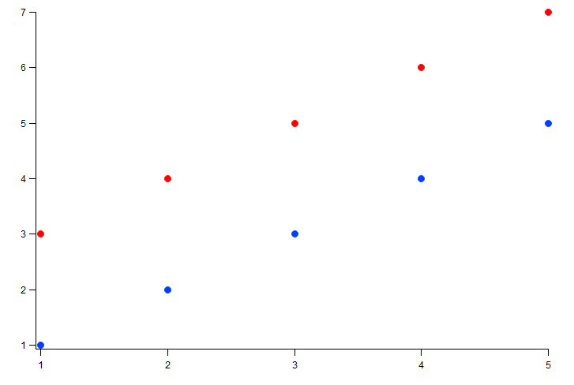
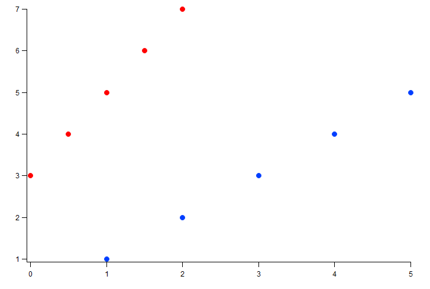
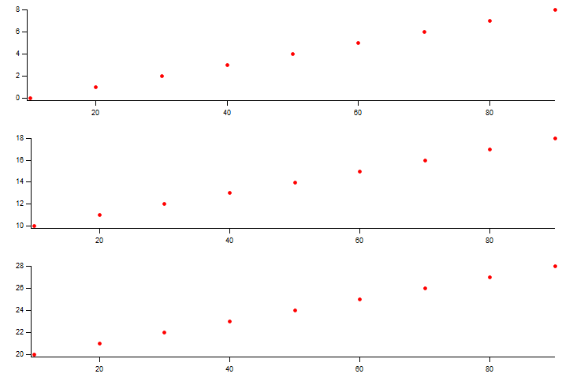

..  vim: set ts=3 sw=3 tw=79 et :

.. _SweepFormula:

The Sweep Formula Module
------------------------

The Sweep Formula Module in `MIES_Sweepformula.ipf` is intended to be used from
the SF tab in the BrowserSettingsPanel (BSP). It is useful for analyzing a
range of sweeps using pre-defined functions. The backend parses a formula into
a `JSON logic <http://jsonlogic.com/>`_ like pattern which in turn is analyzed
to return a wave for plotting.

Preprocessing
^^^^^^^^^^^^^

The entered code in the notebook is preprocessed. The preprocessor
removes comments before testing the code for the ` vs ` operator after which
it is passed to the formula parser.
Comments start with a `#` character and end at the end of the current line.

Formula Parser
^^^^^^^^^^^^^^

In order for a formula to get executed, it has to be analyzed. This assures
that the correct order of calculations is used. The approach for solving this
is using a token based state machine. We virtually insert one character at a
time from left to right into the state machine. Usually, a character is
collected into a buffer. At some special characters like a `+` sign, the state
changes from collect to addition. If a state changes, a new evaluation group is
created which is represented with a JSON object who's (single) member is the
operation. The member name is the operation and the value is an ordered array
of the operands. To ensure that multiplication is executed before addition to
get `1+2*3=7` and not `1+2*3=9` the states have a priority. Higher order states
cause the operation order to switch. The old operation becomes part of the new
operation. In this context, when the first array or function argument separator `,`
is parsed on a level, it is treated as higher order operations because it creates
a new array.

.. code-block:: json

   {
     "+": [
       1,
       {
         "*": [
           2,
           3
         ]
       }
     ]
   }

Arrays start with a square bracket `[` and end with a `]`. Subsequent array elements are
separated by a `,`. In a series of arrays like `[1, 2], [3, 4], [5, 6]` the `,` after
the `]` is enforced by the parser. Arrays can be part of arrays. Since at its core very
formula input is an array the series of arrays `[1, 2], [3, 4], [5, 6]` is implicitly
a 2-dimensional array: `[[1, 2], [3, 4], [5, 6]]`. The same applies for simple inputs like
`1`, which is implicitly treated as 1-dimensional array: `[1]`. The input `[[1]]` instead
is treated as 1x1 2-dimensional array.
Arrays are special as
also function arguments contain array elements. Therefore, an array can also
simply be created by omitting the array brackets and only using element
separators similar as in functions. The function `max(1,2)` is therefore
treated the same as `max([1,2])`. Arrays can represent data and functions
evaluate to arrays. Arrays can be of arbitrary size and can also be
concatenated as in `max(0,min(1,2),1)`.

.. code-block:: json

   {
     "max": [
       0,
       {
         "min": [
           1,
           2
         ]
       },
       1
     ]
   }

A number can be entered as `1000`, `1e3`, or `10.0e2`. It is always stored as a
numeric value and not as string. The formula parser treats everything that is
not parsable but matches alphanumeric characters (excluding operations) to a
string as in `a_string`. White spaces are ignored throughout the
formula which means that strings do *not* need to get enclosed by `"`. In fact,
a `"` is an disallowed character.

.. code-block:: json

   [
     1000,
     "a_string"
   ]

A function is defined as a string that is directly followed by an opening
parenthesis. The parenthesis token causes to force a collect state until all
parentheses are closed.

Everything that is collected in a buffer is sent back to the function via
recursive execution. The formula parser only handles elements inside one
recursion call that are linearly combinable like `1*2+3*4`. If same operations
follow each other, they are concatenated into the same array level as for
`1+2+3+4`.

.. code-block:: json

   {
     "+": [
       1,
       2,
       3,
       4
     ]
   }

.. code-block:: json

   {
     "+": [
       {
         "*": [
           1,
           2
         ]
       },
       {
         "*": [
           3,
           4
         ]
       }
     ]
   }

The formula is sent to a preparser that checks for the correct
amount of brackets and converts multi-character operations to their multi-character
UTF-8 representations like `...` to `…`. It should be noted that an
operation consists of one UTF-8 character. Functions on the other hand can
consist of an arbitrary length of alphanumeric characters. The corresponding
function for the above operation is `range()`.

Formula Executor
^^^^^^^^^^^^^^^^

The formula executor receives a JSON id. It can only evaluate a specific
structure of a formula which means for usual cases that it should start with an
object that contains *one* operation. Operations are evaluated via recursive
calls to the formula executor at different paths. This ensures that the formula
is evaluated from the last element to the first element. The formula in the
above example `1*2+3*4` is therefore treated as

.. code-block:: json

   {
     "+": [
       {
         "*": [
           1,
           2
         ]
       },
       {
         "*": [
           3,
           4
         ]
       }
     ]
   }

which evaluates to

.. code-block:: json

   {
     "+": [
       2,
       12
     ]
   }

and finally to `[24]`. The concept of representing everything as an array also
leaves our final result as an one element array or in Igor Pro context, a one
element wave. At the time of an evaluation, the maximum depth of an array is
3 dimensions as Igor Pro supports only 4 dimensions and one dimension is used
for data alignment.

Note that text waves currently do not accept object evaluation. They are fixed
1-dimensional arrays. This also means that the JSON special chars `"NaN"` and
`"Inf"` representations are not supported as they require mixed-type array
inputs.

In the context of the formula executor, different operations and functions are
defined. Some of them are *MIES* specific, some of them are wrappers to Igor
Pro operations or functions, some borrowed from other languages and there are
also the simple, trivial operations. This section should give a list of the
available operations and give a look into how they are meant to be used

Operations
^^^^^^^^^^

The trivial operations are `+`, `-`, `*`, `/`. They are defined for all
available dimensions and evaluate column based.

They can be used for evaluating

- scalars with 1d waves as in `1 + [1,2] = [2,3]`
- 1d waves with 1d waves as in `[1,2]+[3,4] = [4,6]`
- 1d waves with 2d waves as in `[1,2]+[[3,4],[5,6]] = [[1+3,2+5],[null+4,null+6]] = [[4,7],[null,null]]`
- 2d waves with 2d waves as in `[[1,2],[3,4]]+[[5,6],[7,8]] = [[6,8],[10,12]]`

After evaluation of the operation, the wave is reduced to have the same amount
of dimensions as the input array. The size in each dimension is expanded to
match the maximum array. The expansion is filled with null to avoid undefined
behavior. In the special case of adding a numeric value to an array, the
numeric value is expanded to the full size and dimensions of the largest array.
This means that in our first example, 1 is internally expanded to a size of 2
similar like executing `1 + [1,2] == [1,1] + [1,2]`.

Statistical Functions
^^^^^^^^^^^^^^^^^^^^^

min and max
"""""""""""

`min` and `max` return the minimum and maximum of an array. For one dimension
the result is trivial. In two dimensions they evaluate column based and return
a row based array.

.. code-block:: bash

   min([[1, 2],[3, 4]]) = [1, 2]

   max(min([[1, 2],[3, 4]])) = [2]

   min(2) == [2]

   min() == [null]

The functions accept an arbitrary amount of elements. They are defined only for
one and two dimensions.

avg and mean
""""""""""""

`avg` and `mean` calculate the average :math:`\frac{1}{n}\sum_i{x_i}` of a row
if the wave is 1-dimensional.  They evaluate column-based
:math:`\frac{1}{n_i}\sum_i{x_{ij}}` if the wave has 2 dimensions.

.. code-block:: bash

   avg(1, 2, 3) == [2]

   avg([1, 2, 3],[4, 5, 6],[7, 8, 9]) == [2, 5, 8]

The function is defined only for one and two dimensions.

root mean square
""""""""""""""""

`rms` calculates the root mean square :math:`\sqrt{\frac{1}{n}\sum_i{x_i^2}}`
of a row if the wave is 1-dimensional. It acts column based if the wave is
2-dimensional.

.. code-block:: bash

   rms(1, 2, 3) == [2.160246899469287]

   rms([1, 2, 3],[2, 3, 4],[3, 4, 5]) == [2.160246899469287, 3.109126351029605, 4.08248290463863]

variance and stdev
""""""""""""""""""

`variance` and `stdev` behave similar as above.

.. code-block:: bash

   variance(1, 2, 4) == [2.33333]

   variance([1, 2, 4],[2, 3, 2],[4, 2, 1]) == [2.33333, 0.33333, 2.33333]

   stdev(1, 2, 4) == [1.52753]

   stdev([1, 2, 4],[2, 3, 2],[4, 2, 1]) == [1.52753, 0.57735, 1.52753]

Igor Pro Wrappers
^^^^^^^^^^^^^^^^^

area
""""

Use `area` to calculate the area below a 1D array using trapezoidal integration.
Does work on a per column-basis for 2D arrays. Does zeroing by default, pass
`0` as second argument to turn zeroing off.

.. code-block:: bash

   area([0, 1, 2, 3, 4], 0) == [8]

   area([0, 1, 2, 3, 4], 1) == [4]

derivative
""""""""""

Use `derivative` to differentiate along rows for 1- and 2-dimensional data.
Central differences are used. The same amount of points as the input is returned.

.. code-block:: bash

   derivative(1, 2, 4) == [1, 1.5, 2]

   derivative([1, 2, 4],[2, 3, 2],[4, 2, 1]) == [1, 1, -2],[1.5, 0, -1.5],[2, -1, -1]

integrate
"""""""""

Trapezoid integration similar to the IP `area` function with enabled end-point
guessing. The function returns the same amount of points as the input waves. It
is the counterpart to derivative but due to the end point problem it can
potentially introduce follow-up flaws.

.. code-block:: bash

   integrate(1, 2, 4) == [0, 1.5, 4.5]

   integrate([1, 2, 4],[2, 3, 2],[4, 2, 1]) == [0, 0, 0],[1.5, 2.5, 3],[4.5, 5, 4.5]

butterworth
"""""""""""

The butterworth filter uses `FilterIIR` from Igor Pro and acts along rows. It
strictly accepts four parameters as follows:

.. code-block:: bash

   butterworth(data, lowPassCutoffInHz, highPassCutoffInHz, order)

The first parameter `data` is intended to be used with the `data()` function but
can be an arbitrary numeric array. The parameters lowPassCutoffInHz and highPassCutoffInHz
are divided by `WAVEBUILDER_MIN_SAMPINT_HZ`, that is 200.000 Hz. The maximum order is 100.

.. code-block:: bash

   butterworth([0,1,0,1,0,1,0,1], 90E3, 100E3, 2) == [0, 0.863871, 0.235196, 0.692709, 0.359758, 0.60206, 0.425727, 0.554052]

xvalues and time
""""""""""""""""

The function `xvalues` or `time` are synonyms for the same function.
The function returns a wave containing the scaling of the
input data. It fills the scaling of the rows for all dimensions.

.. code-block:: bash

   xvalues(10, 20, 30, 40, 50) == [0, 1, 2, 3, 4]

   // The sweeps in this example were sampled at 250 kHz.
   // For each data point in the sweep the time is returned.
   time(data([0, 1000], channels(AD), sweeps())) == [0, 0.004, 0.008, 0.012, ...]

setscale
""""""""

`setscale` can add a wave scaling to an input wave. It accepts 1 to 5
parameters. The first parameter is always `data`. If no other parameter is
present, the wave scaling will get cleared for the given dimension.

.. code-block:: bash

   setscale(data[, dim[, dimOffset[, dimDelta[, unit]]]])

`dimOffset` and `dimDelta` default to `0` and `1`, while the `unit` is empty by
default.

.. code-block:: bash

   xvalues(setscale([0, 1, 2, 3, 4], x, 0, 0.2, firkin)) == [0, 0.2, 0.4, 0.6, 0.8]

channels
""""""""

`channels([str name]+)` converts a named channel from string to numbers.

The function accepts an arbitrary amount of typical channel names like `AD` and
`DA` with a combination of numbers `AD1` or channel numbers alone like `2`.

It returns a numeric array of `[[channelType+], [channelNumber+]]` that has the
same row dimension as the input string array.

It is intended to be used with the `data()` function.

.. code-block:: bash

   channels([AD0,AD1, DA0, DA1]) == [[0, 0, 1, 1], [0, 1, 0, 1]]

sweeps
""""""

`sweeps()`

return an array which holds the sweep numbers of all displayed sweeps.
`sweeps(all)` return an array of all available sweeps.

Not implemented yet: The not-yet checked sweeps from overlay sweeps are automatically enabled.

.. code-block:: bash

   // For this example two sweeps were acquired
   sweeps() == [0, 1]

cursors
"""""""

`cursors([A-J]+)` will return the x values of the named cursor in the graph.

.. code-block:: bash

   cursors(A,B) vs A,B

wave
""""

Return the contents of the referenced wave. Useful for debugging and testing
especially.

.. code-block:: bash

   wave(root:mywave)

text
""""

Convert the given numeric output wave to a text wave. This can be used to
force, for example, a category plot.

.. code-block:: bash

   range(5) vs text(range(5))

data
""""

Although being listed near the end, the `data()` function is the core of the
`SweepFormula` library. It returns *MIES* specific data from the current graph.

.. code-block:: bash

   data(array range, array channels, array sweeps)

   data(string epochShortName, array channels, array sweeps)

It returns `[[sweeps][channel]]` for all `[sweeps]` in the array containing the
sweep numbers.

The sweeps that you want to return need to be displayed in the graph. Do this
in the OVS tab.

The range can be either supplied explicitly using `[100, 300]` which would
select `100 ms` to `300 ms` or by using `cursors()`. In case `cursors()` is
used but there are no cursors on the graph, the full x-range is used.

Instead of a numerical range also the short name of an epoch can be given. Then the range
is determined from the epoch information of each sweep/channel data iterates through.

The function does not return errors for unmatched entries. If no entry was found
data returns a single element wave with a `NaN` value.

When executed by the Formula Executor the data wave has the layout:

- ROWS: sweep data
- COLS: sweep number with dimension label `sweepX` where X is an integer
- LAYERS: channels with dimension label <channelnameX>, e.g. AD0.

.. code-block:: bash

   // Shows the AD channels of all sweeps
   data([0, 1000], channels(AD), sweeps())

   // Shows epoch "E1" range of the AD channels of all sweeps
   data("E1", channels(AD), sweeps())

labnotebook
"""""""""""

`labnotebook(string key, array channels, array sweeps [, string
entrySourceType])` returns the (case insensitive) `key` entry from the
labnotebook for the given channel and sweep combination. The optional
`entrySourceType` can be one of the constants `DataAcqModes` for data
acquisition modes as defined in `../MIES/MIES_Constants.ipf`. If the
`entrySourceType` is omitted it defaults to `DATA_ACQUISITION_MODE`.

The `labnotebook()` function has the same data layouting as the `data()`
function. It returns the notebook entry in the rows for all `[sweeps]` with the
corresponding `[channel]` (`[[sweeps][channel]]`).

.. code-block:: bash

   max(
      data(
         cursors(AB)
         channels(AD),
         sweeps()
      )
   )
   vs
   labnotebook(
      "set cycle count",
      channels(AD),
      sweeps(),
      DATA_ACQUISITION_MODE
   )

The function searches for numeric entries in the labnotebook first and then for
text entries. It returns `NaN` if no match was found. It adds dimension labels
to the columns to indicate the channel names.

findlevel
"""""""""

`findlevel(data, level, [edge])` will return the x position of the found level
or `NaN` if nothing could be found. The edge type is by default rising
and falling (`0`), other options are rising (`1`) or falling (`2`).

.. code-block:: bash

   findlevel([1, 2, 3], 1.5) == [0.5]

apfrequency
"""""""""""

`apfrequency(data, [method, level])` will return the action potential frequency
using the `full` (default or `0`), `instantaneous` (`1`) or
`apcount` (`2`) method. The default level is `0`.

The calculation for these methods are done using the below formulas where
:math:`l` denotes the number of found levels, :math:`t_{i}` the timepoint in
seconds of the level and :math:`T` the total x range of the data in seconds.

.. math::
   f_{\text{full}}          &= \frac{l}{T}                                                         \\
   f_{\text{instantaneous}} &= \frac{1}{\sum_{i = 0}^{i = l - 1} \left( t_{i + 1} - t_{i} \right)} \\
   f_{\text{apcount}}       &= l                                                                   \\

.. code-block:: bash

   apfrequency([10, 20, 30], 1, 15)

Various
^^^^^^^

range
"""""

The range function is borrowed from `python
<https://docs.python.org/3/library/functions.html#func-range>`_. It expands
values into a new array.

This function can also be used as an operation with the "…" operator which is
the Unicode Character 'HORIZONTAL ELLIPSIS' (U+2026).

.. code-block:: bash

   range(start[, stop[, step]])

   start…stop

The function generally accepts 1 to 3 arguments. The operation is intended to be
used with two arguments.

.. code-block:: bash

   range(1, 5, 0.7) == [1, 1.7, 2.4, 3.1, 3.8, 4.5]

epochs
""""""

The epochs function returns information from epochs.

.. code-block:: bash

   epochs(string name, array channels, array sweeps[, string type])

type sets what information is returned. Valid types are: `range`, `name`, `treelevel`.
If type is not specified then `range` is used as default.

range:
The operation returns a 2xN wave with the start and end time of the epoch(s) in [ms] for all active channels.
If only a single epoch is returned then the operation returns a 1D wave with two elements, as the range function.
The order of returned ranges for the N dimension is: sweeps( channels ).
If a sweep/channel combination does not have epoch information saved `[NaN, NaN]` is returned as range for this combination.
If no matching epoch was found a zero sized wave is returned.

name:
The full names of the epochs are returned in a 1D text wave.
If a sweep/channel combination does not have epoch information saved an empty string is returned as name for this combination.
If no matching epoch was found a zero sized wave is returned.

treelevel:
The tree levels of the epochs are returned in a 1D wave.
If a sweep/channel combination does not have epoch information saved `NaN` is returned as tree level for this combination.
If no matching epoch was found a zero sized wave is returned.

.. code-block:: bash

   // two sweeps acquired with two headstages set with PulseTrain_100Hz_DA_0 and PulseTrain_150Hz_DA_0 from _2017_09_01_192934-compressed.nwb
   epochs(ST, channels(AD), sweeps(), range) == [[20, 1376.01], [20, 1342.67], [20, 1376.01], [20, 1342.67]]

tp
""

The tp function returns analysis values for test pulses that are part of sweeps.

.. code-block:: bash

   tp(variant type, array channels, array sweeps)

type sets what test pulse analysis value is returned.
The following types are supported:

base or 0: Returns the baseline level in pA or mV depending on the clamp mode.

inst or 1: Returns the instantaneous resistance values in MΩ.

ss or 2: Returns the steady state resistance values in MΩ.

The returned array is 1 x M x N, where M indexes the sweeps and N indexes the channels. Thus,
sweep and channel information gets transferred as well.
Values for non-existing sweeps and/or channels are set NaN.
If a single sweep contains multiple test pulses then the data from the test pulse ranges is averaged.
The test pulses in the sweep must have the same duration.
Test pulses that are part of sweeps are identified through their respective epoch short name, that
starts with "TP" or "U_TP". If sweeps and channels can resolve existing single sweeps but none contain
epochs for test pulses then a numeric single element wave is returned with the value NaN.

.. code-block:: bash

   // Get steady state resistance from all sweeps and all AD channels
   tp(ss, channels(AD), sweeps())

   // Get base line level from all sweeps and DA1 channel
   tp(static, channels(DA1), sweeps())

merge
"""""

`merge` reduces a 2-dimensional array to a 1-dimensional array similar to
removing all inner square brackets:

.. code-block:: bash

   merge([1, [2, 3], 4]) == [1, 2, 3, 4]

log
"""

`log` prints the first element of the current array to the command line but
passes the wave as usual to the next operation. It is useful for debugging
inside large formulas.

.. code-block:: bash

   // outputs "1" to the history area
   log(1, 10, 100) == [1, 10, 100]

Both, `merge` and `log` are defined in `JSON logic <http://jsonlogic.com/>`_.

log10
"""""

Apply the decadic (base 10) logarithm to its input.

.. code-block:: bash

   log10(1, 10, 100) == [0,1,2]

Plotting
^^^^^^^^

When clicking the `Display` button in the SF tab the formula gets parsed, executed and
the result plotted. Running the JSON object from the Formula Parser through the Formula Executor
gives a resulting wave. The data from the rows is plotted as traces and the columns and layers
are evaluated as an array of traces. Thus, a single plotted trace is created by the following input:
`1, 2, 3, 4, 5`. Two traces with 5 data points each are created by this input:
`[1, 3], [2, 4], [3, 5], [4, 6], [5, 7]`. Whereas the input `0...10, 20...30` creates
ten traces with two data points each, starting with the first trace X = 0, Y = 0; X = 1, Y = 20.

In typical use cases instead of explicitly writing static data in the formula the data
operation is utilized that returns data in the correct array layout.

Separate X-values
"""""""""""""""""

Sometimes it is useful to explicitly specify X values for a series of data values.
Therefore, two formulas can be plotted against each other by using the vs operator.

.. code-block:: bash

   0...10 vs range(10, 100, 10)

gives

.. figure:: svg/sweepFormulaPlot.svg
   :align: center

Note that in this example there are 10 Y-values and only 9 X-values returned by the
respective formula part. The resulting graph shows 9 data points and thus does not show
data points where either an X or Y value for the X, Y value pair is missing.

The plotter supports the same X values for multiple traces:

.. code-block:: bash

   [1, 3], [2, 4], [3, 5], [4, 6], [5, 7] vs 1...6

This example plots two traces with five data points each against equidistant
X coordinates 1, 2, 3, 4, 5. The first trace is colored blue for demonstration.
This also works for a constant X value and multiple traces.
The same way separate X value series for traces can be set:

.. code-block:: bash

   [1, 3], [2, 4], [3, 5], [4, 6], [5, 7] vs [1, 0], [2, 0.5], [3, 1], [4, 1.5], [5, 2]

The above example plots two traces with the first one Y series: 1, 2, 3, 4, 5; X series: 1, 2, 3, 4, 5
and the second Y series: 3, 4, 5, 6, 7; X series: 0, 0.5, 1, 1.5, 2.
The first trace is colored blue for demonstration.

Multiple graphs
"""""""""""""""

Several graphs can generated with a single input by separating the formulas
with `and`. The `and` must be on an own line.

.. code-block:: bash

   0...10 vs range(10, 100, 10)
   and
   10...20 vs range(10, 100, 10)
   and
   20...30

The above code creates a panel with three separate graphs arranged vertically evenly spaced.

