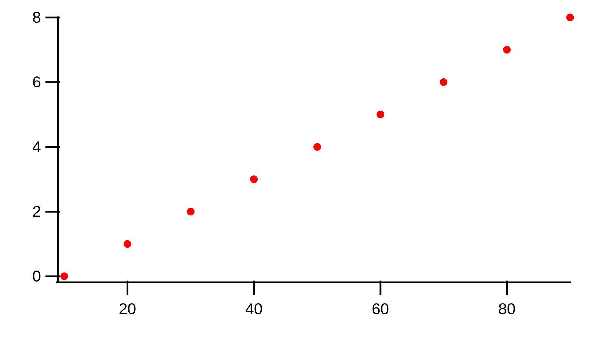

..  vim: set ts=3 sw=3 tw=79 et :

The Sweep Formula Module
------------------------

The Sweep Formula Module in `MIES_Sweepformula.ipf` is intended to be used from
the SF tab in the BrowserSettingsPanel (BSP). It is useful for analyzing a
range of sweeps using pre-defined functions. The backend parses a formula into
a `JSON logic <http://jsonlogic.com/>`_ like pattern which in turn is analyzed
to return a wave for plotting.

Formula Parser
^^^^^^^^^^^^^^

In order for a formula to get executed, it has to be analyzed. This assures
that the correct order of calculations is used. The approach for solving this
is using a token based state machine. We virtually insert one character at a
time from left to right into the state machine. Usually, a character is
collected into a buffer. At some special characters like a `+` sign, the state
changes from collect to addition. If a state changes, a new evaluation group is
created which is represented with a JSON object who's (single) member is the
operation. The member name is the operation and the value is an ordered array
of the operands. To ensure that multiplication is executed before addition to
get `1+2*3=7` and not `1+2*3=9` the states have a priority. Higher order states
cause the operation order to switch. The old operation becomes part of the new
operation. In this context, also the array or function argument separators `,`
are treated as higher order operations.

.. code-block:: json

   {
     "+": [
       1,
       {
         "*": [
           2,
           3
         ]
       }
     ]
   }

Arrays start with a square bracket `[` and end with a `]`. They are special as
also function arguments contain array elements. Therefore, an array can also
simply be created by omitting the array brackets and only using element
separators similar as in functions. The function `max(1,2)` is therefore
treated the same as `max([1,2])`. Arrays can represent data and functions
evaluate to arrays. Arrays can be of arbitrary size and can also be
concatenated as in `max(0,min(1,2),1)`.

.. code-block:: json

   {
     "max": [
       0,
       {
         "min": [
           1,
           2
         ]
       },
       1
     ]
   }

A number can be entered as `1000`, `1e3`, or `10.0e2`. It is always stored as a
numeric value and not as string. The formula parser treats everything that is
not parsable but matches alphanumeric characters (excluding operations) to a
string as in `a_string`. White spaces are ignored throughout the
formula which means that strings do *not* need to get enclosed by `"`. In fact,
a `"` is an unallowed character.

.. code-block:: json

   [
     1000,
     "a_string"
   ]

A function is defined as a string that is directly followed by an opening
parenthesis. The parenthesis token causes to force a collect state until all
parentheses are closed. A similar approach is used for comments. A comment
character `#` causes the skip state which does not write to the buffer until a
line ending character is encountered.

Everything that is collected in a buffer is sent back to the function via
recursive execution. The formula parser only handles elements inside one
recursion call that are linearly combinable like `1*2+3*4`. If same operations
follow each other, they are concatenated into the same array level as for
`1+2+3+4`.

.. code-block:: json

   {
     "+": [
       1,
       2,
       3,
       4
     ]
   }

.. code-block:: json

   {
     "+": [
       {
         "*": [
           1,
           2
         ]
       },
       {
         "*": [
           3,
           4
         ]
       }
     ]
   }

The formula can be optionally sent to a preparser that checks for the correct
amount of brackets and converts multi-character operations to their multi-character
UTF-8 representations like `...` to `…`. It should be noted that an
operation consists of one UTF-8 character. Functions on the other hand can
consist of an arbitrary length of alphanumeric characters. The corresponding
function for the above operation is `range()`.

Formula Executor
^^^^^^^^^^^^^^^^

The formula executor receives a JSON id. It can only evaluate a specific
structure of a formula which means for usual cases that it should start with an
object that conatains *one* operation. Operations are evaluated via recursive
calls to the formula executor at different paths. This ensures that the formula
is evaluated from the last element to the first element. The formula in the
above example `1*2+3*4` is therefore treated as

.. code-block:: json

   {
     "+": [
       {
         "*": [
           1,
           2
         ]
       },
       {
         "*": [
           3,
           4
         ]
       }
     ]
   }

which evaluates to

.. code-block:: json

   {
     "+": [
       2,
       12
     ]
   }

and finally to `[24]`. The concept of representing everything as an array also
leaves our final result as an one element array or in Igor Pro context, a one
elemented wave. At the time of an evaluation, the maximum depth of an array is
3 dimensions as Igor Pro supports only 4 dimensions and one dimension is used
for data alignment.

Note that text waves currently do not accept object evaluation. They are fixed
1-dimensional arrays. This also means that the JSON special chars `"NaN"` and
`"Inf"` representations are not supported as they require mixed-type array
inputs.

In the context of the formula executor, different operations and functions are
defined. Some of them are *MIES* specific, some of them are wrappers to Igor
Pro operations or functions, some borrowed from other languages and there are
also the simple, trivial operations. This section should give a list of the
available operations and give a look into how they are meant to be used

Operations
^^^^^^^^^^

The trivial operations are `+`, `-`, `*`, `/`. They are defined for all
available dimensions and evaluate column based.

They can be used for evaluating

- scalars with 1d waves as in `1 + [1,2] = [2,3]`
- 1d waves with 1d waves as in `[1,2]+[3,4] = [4,6]`
- 1d waves with 2d waves as in `[1,2]+[[3,4],[5,6]] = [[1+3,2+5],[null+4,null+6]] = [[4,7],[null,null]]`
- 2d waves with 2d waves as in `[[1,2],[3,4]]+[[5,6],[7,8]] = [[6,10],[8,12]]`

After evaluation of the operation, the wave is reduced to have the same amount
of dimensions as the input array. The size in each dimension is expanded to
match the maximum array. The expansion is filled with null to avoid undefined
behavior. In the special case of adding a numeric value to an array, the
numeric value is expanded to the full size and dimensions of the largest array.
This means that in our first example, 1 is internally expanded to a size of 2
similar like executing `1 + [1,2] == [1,1] + [1,2]`.

Statistical Functions
^^^^^^^^^^^^^^^^^^^^^

min and max
"""""""""""

`min` and `max` return the minimum and maximum of an array. For one dimension
the result is trivial. In two dimensions they evaluate column based and return
a row based array.

.. code-block:: bash

   min([[1,2],[3,4]]) = [1,2]

   max(min([[1,2],[3,4]])) = [2]

   min(2) == [2]

   min() == [null]

The functions accept an arbitrary amount of elements. They are defined only for
one and two dimensions.

avg and mean
""""""""""""

`avg` and `mean` calculate the average :math:`\frac{1}{n}\sum_i{x_i}` of a row
if the wave is 1-dimensional.  They evaluate column-based
:math:`\frac{1}{n_i}\sum_i{x_{ij}}` if the wave has 2 dimensions.

.. code-block:: bash

   avg(1,2,3) == [2]

   avg([1,2,3],[4,5,6],[7,8,9]) == [2,5,8]

The function is defined only for one and two dimensions.

root mean square
""""""""""""""""

`rms` calculates the root mean square :math:`\sqrt{\frac{1}{n}\sum_i{x_i^2}}`
of a row if the wave is 1-dimensional. It acts column based if the wave is
2-dimensional.

variance and stdev
""""""""""""""""""

`variance` and `stdev` behave similar as above.

Igor Pro Wrappers
^^^^^^^^^^^^^^^^^

derivative
""""""""""

Use `derivative` to differentiate along rows for 1 and 2 data.

integrate
"""""""""

Trapezoid integration similar to the IP `area` function with enabled end-point
guessing. The function returns the same amount of points as the input waves. It
is the counterpart to derivative but due to the end point problem it can
potentially introduce follow-up flaws.

butterworth
"""""""""""

The butterworth filter uses `FilterIIR` from Igor Pro and acts along rows. It
strictly accepts 4 parameters as follows:

.. code-block:: bash

   butterworth(data, lowPassCutoffInHz, highPassCutoffInHz, order)

The first parameter `data` is intended to be used with the `data()` function but
can be an arbitrary numeric array.

xvalues and time
""""""""""""""""

The `xvalues` or `time` function returns a wave containing the scaling of the
input data. It fills the scaling of the rows for all dimensions.

setscale
""""""""

`setscale` can add a wave scaling to an input wave. It accepts 1 to 5
parameters. The first parameter is always `data`. If no other parameter is
present, the wave scaling will get cleared for the given dimension.

.. code-block:: bash

   setscale(data[, dim[, dimOffset[, dimDelta[, unit]]]])

`dimOffset` and `dimDelta` default to `0` and `1`, while the `unit` is empty by
default.

channels
""""""""

`channels([str name]+)` converts a named channel from string to numbers.

The function accepts an arbitrary amount of typical channel names like `AD` and
`DA` with a combination of numbers `AD1` or channel numbers alone like `2`.

it returns a numeric array of `[[channelName, channelNumber]+]` that has the
same dimension as the input string array.

It is inteded to be used with the `data()` function.

sweeps
""""""

`sweeps()`

return an array which holds the sweep numbers of all displayed sweeps.
`sweeps(all)` return an array of all available sweeps. The not-yet checked sweeps
from overlay sweeps will be automatically enabled.

.. note::

   Not yet fully implemented.

cursors
"""""""

`cursors([A-J]+)` will return the x values of the named cursor in the graph.

.. code-block:: bash

   cursors(A,B) vs A,B

wave
""""

Return the contents of the referenced wave. Useful for debugging and testing
especially.

.. code-block:: bash

   wave(root:mywave)

text
""""

Convert the given numeric output wave to a text wave. This can be used to
force, for example, a category plot.

.. code-block:: bash

   range(5) vs text(range(5))

data
""""

Although being listed near the end, the `data()` function is the core of the
`SweepFormula` library. It returns *MIES* specific data from the current graph.

.. code-block:: bash

   data(array range, array channels, array sweeps)

It returns `[[sweeps][channel]]` for all `[sweeps]` in the array containing the
sweep numbers. The output is grouped by channels.

The sweeps that you want to return need to be displayed in the graph. Do this
in the OVS tab.

The range can be either supplied explicitly using `[100, 300]` which would
select `100 ms` to `300 ms` or by using `cursors()`. In case `cursors()` is
used but there are no cursors on the graph, the full x-range is used.

The function does not return errors for unmatched entries.

labnotebook
"""""""""""

`labnotebook(string key, array channels, array sweeps [, string
entrySourceType])` returns the (case insensitive) `key` entry from the
labnotebook for the given channel and sweep combination. The optional
`entrySourceType` can be one of the constants `DataAcqModes` for data
acquisition modes as defined in `../MIES/MIES_Constants.ipf`. If the
`entrySourceType` is omitted it defaults to `DATA_ACQUISITION_MODE`.

The `labnotebook()` function has the same data layouting as the `data()`
function. It returns the notebook entry in the rows for all `[sweeps]` with the
corresponding `[channel]` (`[[sweeps][channel]]`).

.. code-block:: bash

   max(
      data(
         cursors(AB)
         channels(AD),
         sweeps()
      )
   )
   vs
   labnotebook(
      "set cycle count",
      channels(AD),
      sweeps(),
      DATA_ACQUISITION_MODE
   )

The function searches for numeric entries in the labnotebook first and then for
text entries. It returns `NaN` if no match was found. It adds dimension labels
to the columns to indicate to indicate the channel names.

findlevel
"""""""""

`findlevel(data, level, [edge])` will return the x position of the found level
or `NaN` if nothing could be found. The edge type is by default rising
and falling (`0`), other options are rising (`1`) or falling (`2`).

.. code-block:: bash

   findlevel([1, 2, 3], 1.5)

apfrequency
"""""""""""

`apfrequency(data, [method, level])` will return the action potential frequency
using the `full` (default or `0`), `instantaneous` (`1`) or
`apcount` (`2`) method. The default level is `0`.

The calculation for these methods are done using the below formulas where
:math:`l` denotes the number of found levels, :math:`t_{i}` the timepoint in
seconds of the level and :math:`T` the total x range of the data in seconds.

.. math::
   f_{\text{full}}          &= \frac{l}{T}                                                         \\
   f_{\text{instantaneous}} &= \frac{1}{\sum_{i = 0}^{i = l - 1} \left( t_{i + 1} - t_{i} \right)} \\
   f_{\text{apcount}}       &= l                                                                   \\

.. code-block:: bash

   apfrequency([10, 20, 30], 1, 15)

Various
^^^^^^^

range
"""""

The range function is borrowed from `python
<https://docs.python.org/3/library/functions.html#func-range>`_. It expands
values into a new array.

This function can also be used as an operation with the "…" operator which is
the Unicode Character 'HORIZONTAL ELLIPSIS' (U+2026).

.. code-block:: bash

   range(start[, stop[, step]])

   start…stop

The function generally accepts 1 to 3 arguments. The operation is inteded to be
used with two arguments. Please note that you can use the preparser if you
keyboard layout does not allow convenient typing of this character.  It is not
too easy to implement multi-character token inputs at this stage. Use the range
function if you do not like any of these approaches.

merge
"""""

`merge` reduces a 2-dimensional array to a 1-dimensional array similar to
removing all inner square brackets:

.. code-block:: bash

   merge([1,[2,3],4]) == [1,2,3,4]

log
"""

`log` prints the first element of the current array to the command line but
passes the wave as usual to the next operation. It is usefull for debugging
inside large formulas.

Both, `merge` and `log` are defined in `JSON logic <http://jsonlogic.com/>`_.

log10
"""""

Apply the decadic (base 10) logarithm to its input.

Plotting
^^^^^^^^

Two formulas can be plotted against each other by using the vs operator.

.. code-block:: bash

   0...10 vs range(10, 100, 10)

gives

