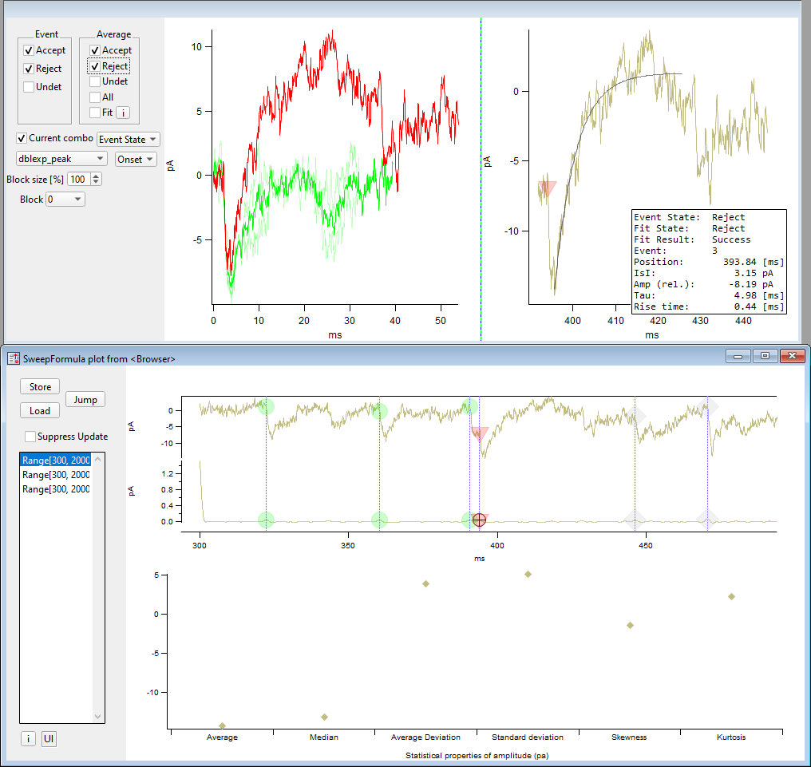

.. _sweepformula_psx:

SweepFormula PSC/PSP classification
===================================

When using the :ref:`sf_op_psx` SweepFormula operation the normal graphing is
enhanced by various additional graphs and user interface options.
The following graph shows the layout for a `psx` and `psxStats` operation with
real acquired data.

.. _Figure SweepFormula PSX:

   SweepFormula PSX GUI

The main panel ``SweepFormula plot from <Browser>`` has a left vertical column
with UI controls, the `psx` graph at the top and a `psxstats` graph at the bottom.

Above the main panel are again some UI controls on the very left, the all event
graph and then the single event graph at the very right.

Main panel
^^^^^^^^^^

Left UI controls
""""""""""""""""

- ``Store``: Store the event properties including the classification results
  (``Event State`` and ``Fit State``) in the results waves using the
  ``id`` as key and JSON as serialization format.

- ``Load``: Load the event properties from the results wave using the currently
  active ``id``

- ``Jump``: Jump to the next event having event state undetermined, also
  changes the combination if required.

- ``Suppress Update``: Avoid updating the top all and single event graphs on
  event/fit state and/or cursor changes.

- ``ListBox``: The combinations listbox has an entry for every combination of
  ``range`` and ``select`` where `psx` found at least one event. The `psx`
  graph only ever plots one combination, and therefore one can choose the
  to-be-plotted combination here.

- ``i``: Button to copy the `psx`/`psxkernel`/`psxRiseTime` input parameters to
  the clipboard

- ``UI``: Hover over this element with the mouse to learn about the keyboard shortcuts

psx
---

The `psx` graph represents the results of the event search and is split
vertically into two graphs. The top one shows the filtered and offsetted sweep
data, the lower one in addition the deconvolution with the input from `psxkernel`.

All found events are marked initially as undetermined for the Event/Fit state.

The Event state is visualized by colorized markers: a grey square for
undetermined, a green circle for accept and a red triangle for reject.

With the ``A`` cursor a single event can be selected, properties of that event are
displayed in the single event graph (top right).

The following options exist to set the event and fit state of a single or multiple events:

Mouse Control
~~~~~~~~~~~~~

- Toggle the state of a single event by pressing ``CTRL`` and clicking on it
  with the left mouse button

- Draw a marquee and select one of following custom menu entries:

  - ``PSX: Accept Event & Fit``
  - ``PSX: Reject Event & Fit``
  - ``PSX: Accept Fit``
  - ``PSX: Reject Fit``

  which operate on all events inside the marquee and perform the obvious thing.

  The ``PSX: Jump to Events`` entry is only useful inside the `psxstats` graph as
  it brings the events inside the marquee into view in the `psx` plot.

Keyboard Control
~~~~~~~~~~~~~~~~

The following keyboard shortcuts work for either the `psx` or the `psxstats`
graphs. All of them require that the cursor ``A`` is located on an event, which
is by default the case for the `psx` graph. The current direction for automatic
advancement defaults to left-to-right.

- ``↑`` (up): Accept the current event, changing both event and fit state to
  accept, and advance the cursor to the next event in the current direction
- ``↓`` (down): Reject the current event, changing both event and fit state to
  reject, and advance the cursor to the next event in the current direction
- ``→`` (right): Move the cursor to the next event on the right
- ``←`` (left): Move the cursor to the previous event on the left
- ``(space)``: Toggle the event and fit state of the current event without any movement
- ``r``: Reverse the current direction
- ``c``: Center the x-axis around the current event
- ``e``: Toggle the event state
- ``f``: Toggle the fit state
- ``z``: Accept the event state but reject the fit state

psxstats
--------

Visualizes properties of the given combinations. The marquee and the keyboard
control options from the `psx` graph are also available.

Top Panel
^^^^^^^^^

Left UI controls
""""""""""""""""

The combination to select the drawn single events and their averages from are
determined by the state of the ``Current combo`` checkbox. The state to use for
the selection, either fit or event state, is determined by the popup menu.

- ``Accept``: Show all accepted events
- ``Reject``: Show all rejected events
- ``Undetermined``: Show all undetermined events
- ``Average``:

  - ``Accept``: Show all the average of all accepted events
  - ``Reject``: Show all the average of all rejected events
  - ``Undetermined``: Show the average of all undetermined events
  - ``All``: Show the average of all events regardless of the state
  - ``Fit``: Show the fit of the averaged events, the fit coefficients are also
             stored in the results wave

      - ``i``: Hover over this element with the mouse to view the average fit
        coefficients

- ``Current combo``: Restrict the event selection to the currently selected
  combination (checked) or use all of them (unchecked)
- ``Fit State/Event State``: Select the state to use as basis for selection
- ``dblexp_peak/dblexp_XOffset``: Select the fit curve for the average fit
- ``Onset/peak``: Select the event property to offset the events in the all
  events graph to
- ``Block size [%]``: Percentage to select what part of the events are
  displayed in the all events graph. This can help with reducing the number of
  plotted events so that the interactive event classification in the all event
  graph is easier.
- ``Block``: Block number to display in the all events graph in case a block
  size smaller than 100% was selected.

All event graph
---------------

The top left graph shows events and average selected by the UI controls to its
left. The state can be changed by hovering the mouse over an event trace and
pressing the keyboard shortcuts available for the `psx` graph.

Single event graph
------------------

The top right graph shows a single event including its fit (greyish line) which might
not be present as well. The shown event is selected by cursor ``A`` in the `psx`
graph. The textbox has various properties of the shown event.

No UI options are available for this graph.
