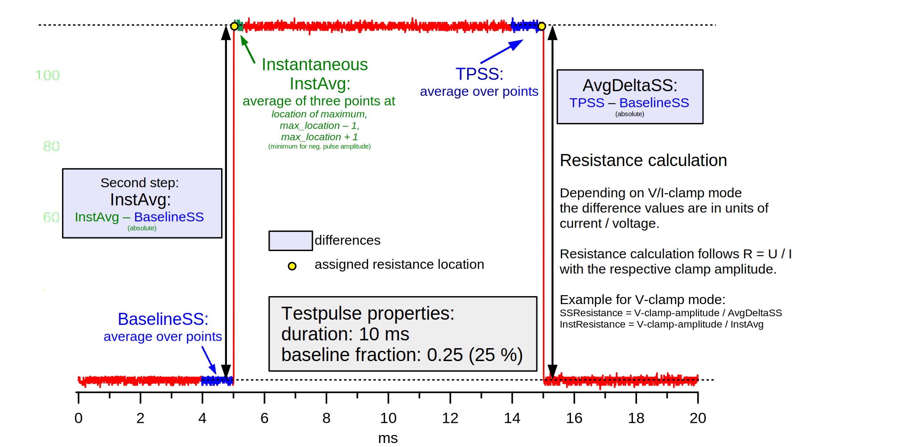

 .. _TP_delta_doc:

Testpulse Analysis Algorithm
----------------------------

This algorithm has been moved as simpler code to :cpp:func:`TP_TSAnalysis` and :cpp:func:`TP_ROAnalysis`.

Description
===========

The algorithm analyses the measured test pulse response to determine the ``instantaneous resistance``,
the ``steady state resistance`` and the ``baseline steady state``.

The :cpp:func:`TP_Delta` function is called after data is available for each device.
This data can contain test pulse responses from several head stages from multiple ADC channels.

The function is split into several parts:

 - `Principles`_
 - `Miscellaneous at startup`_
 - `Retrieving input data`_
 - `Extraction of ranges`_ in points in the data for ``baseline``, ``elevated`` (aka ``steady state``) and ``instanenous``
 - `Calculation`_
 - `Running Average of results`_
 - `Final Calls`_

Principles
==========

The goal of the algorithm is to determine the base line level,
steady state resistance and instantaneous resistance of a test pulse response.
The available data contains the response pulse as
well as information about the excitation amplitude and length.
The excitation pulse is in units of current or voltage depending on the used
clamp mode. The actual data consists of discrete points of analog to digital
input (response).
For simplicity this will be neglected in the following.

The resistance is calculated by

.. math::
   R = \frac{U}{I}

Where depending on voltage- or current clamp mode the response test pulse is either
a current or voltage. The response is the difference between base line live and
steady state / instantaneous level. For determining the levels in the response data
ranges are defined where the data points get averaged.

The known ranges are

.. math::
   baselinefraction &= fullTPrange * baselinefrac \\
   duration &= activeTPtime

Where **baselinefrac** is the part relative to the full test pulse range in the
front of the test pulse where the excitation signal was at its base line level.
The time **duration** is the length of the active portion of the exciting test pulse.

The range for averaging for the base line level is defined minimum of:

.. math::
   baselineAvgRange = Min( 5 ms, 0.2 * duration, 0.2 * baselinefraction)

The reference point for the end of the range is defined to be close to the start
of the active test pulse:

.. math::
   end &= baselinefraction - const \\
   begin &= end - baselineAvgRange

The base line level is determined by averaging over all discrete data points
**p** in this range:

.. math::
   baselinelevel = \frac{1}{N} \sum^{end}_{n=begin} p_n

The range for averaging for the steady state level is defined to be equal to the
base line averaging length. The reference point for the end of the range is
defined to be close to the end of the active test pulse:

.. math::
   end &= (1 - baselinefrac) * fullTPrange - const \\
   begin &= end - baselineAvgRange

The steady state level is determined by averaging over all discrete data points
**p** in this range:

   .. math::
      steadystatelevel = \frac{1}{N} \sum^{end}_{n=begin} p_n

The range for averaging for the instantaneous level is *0.25 ms*. The reference
point for the start of the range is defined to be close after the start of the
active test pulse:

   .. math::
      end &= baselinefraction + const \\
      begin &= end - 0.25 ms

In this partial range P :sub:`I` of all points p the discrete location of the
point with maximum value is determined.

   .. math::
      locMax = MaxLocation(P_I); P_I = P[begin, end]

The instantaneous level is determined by averaging over the data point **p** at
**locMax** and its two neighboring points:

   .. math::
      instantaneouslevel = \frac{1}{3} \sum^{locMax + 1}_{n=locMax - 1} p_n

Note that the constant *const* for the reference point offset is the same for
all three ranges.

The current/voltage amplitudes for are the differences of the levels to the base
line level:

.. math::
   steadstateAmp &= steadystatelevel - baselinelevel \\
   instantaneousAmp &= instantaneouslevel - baselinelevel

With the amplitudes and the known clamp amplitudes the resistances are:

.. math::
   R_{SS} &= \frac{steadystateAmp}{currentClampAmp} \\
   R_{Inst} &= \frac{instantaneoueAmp}{currentClampAmp}

Respectively for voltage clamp:

.. math::
   R_{SS} &= \frac{voltageClampAmp}{steadystateAmp} \\
   R_{Inst} &= \frac{voltageClampAmp}{instantaneoueAmp}

The function returns the resistances as well as the base line level.

Miscellaneous at startup
========================

To log the function execution time the current time is retrieved by

.. code-block:: igorpro

   referenceTime = DEBUG_TIMER_START()

The test pulse response is saved if the GUI checkbox was enabled by :cpp:func:`TP_StoreFullWave`:

.. code-block:: igorpro

   WAVE GUIState = GetDA_EphysGuiStateNum(panelTitle)

   if(GUIState[0][%check_Settings_TP_SaveTP])
     TP_StoreFullWave(panelTitle)
   endif

Retrieving input data
=====================

The device specific data folder for the test pulse is retrieved. The current and
voltage clamp parameters are retrieved from it. It is used as well to put the
calculated ``BaselineSSAvg``, ``SSResistance`` and ``InstResistance`` back to the
devices test pulse data folder.

.. code-block:: igorpro

   DFREF dfr = GetDeviceTestPulse(panelTitle)

The actual test pulse data is retrieved from OscilloscopeData, where the data
points are stored in rows and the columns count the DAC, ADC and TTL channels
(in this order).

.. code-block:: igorpro

   WAVE OscilloscopeData = GetOscilloscopeWave(panelTitle)

Retrieve device specific Current Clamp and Voltage Clamp amplitudes. The values
are in ``pA`` and ``mV`` and can be set on the front panel in the tab
"Data Acquisition". Default: -50 pA / 10 mV.

.. code-block:: igorpro

   NVAR/SDFR=dfr amplitudeICGlobal = amplitudeIC
   NVAR/SDFR=dfr amplitudeVCGlobal = amplitudeVC

Retrieve the column of the first ADC channel in OscilloscopeData wave,
due to the DAC, ADC, TTL order it is 1 for one enabled head stage,
2 for two enabled head stages a.s.o.

.. code-block:: igorpro

   NVAR ADChannelToMonitor = $GetADChannelToMonitor(panelTitle)

Retrieve head stage properties, where rows count the active head stages and
columns enumerate the properties. It is used later to decide if a certain head
stage operates in current clamp or voltage clamp mode.

.. code-block:: igorpro

   WAVE activeHSProp = GetActiveHSProperties(panelTitle)

Duration of the test pulse (active time) in points.

.. code-block:: igorpro

   NVAR duration     = $GetTestpulseDuration(panelTitle)

The test pulse is centered on a baseline, the baselineFrac is a number < 1, that
defines the fraction in front and after the test pulse. Example: With a typical
value of 0.25 for baselineFrac, the whole test pulse consists of parts of
0.25_baseline + 0.5_testpulse + 0.25_baseline.

.. code-block:: igorpro

   NVAR baselineFrac = $GetTestpulseBaselineFraction(panelTitle)

Length of the test pulse in points

.. code-block:: igorpro

   lengthTPInPoints  = TP_GetTestPulseLengthInPoints(panelTitle)

Length of the buffer that stores previous results of ``BaselineSSAvg``,
``SSResistance`` and ``InstResistance`` for a running average. The running
average is later applied by :cpp:func:`TP_CalculateAverage` if the size is > 1.
The size is set on the front panel in the *Settings* tab.

.. code-block:: igorpro

   NVAR tpBufferSize = $GetTPBufferSizeGlobal(panelTitle)

The later resistance calculation is based on R = U / I. Since R is always
positive, the sign of the local clamp current/voltage variables is removed.

.. code-block:: igorpro

   amplitudeIC = abs(amplitudeICGlobal)
   amplitudeVC = abs(amplitudeVCGlobal)

Extraction of ranges
====================

The duration of the test pulse is converted to time by using the scale delta of
the OscilloscopeData waves rows, which is the sample interval.

.. code-block:: igorpro

   durationInTime = duration * DimDelta(OscilloscopeData, ROWS)

The length in time of the base line fraction is calculated by the fraction of the
full test pulse length multiplied by the scale delta of the OscilloscopeData
waves rows, which is the sample interval.

.. code-block:: igorpro

   baselineInTime = baseLineFrac * lengthTPInPoints * DimDelta(OscilloscopeData, ROWS)

For the determination of the baseline level and the steady state level a small
range of points is taken into account. The range the lowest value of either

  - 5 ms
  - 20% of the test pulse duration
  - 20% of the base line duration

The range is converted to points by dividing through the sample interval.

.. code-block:: igorpro

   evalRangeInPoints = min(5, 0.2 * min(durationInTime, baselineInTime)) / DimDelta(OscilloscopeData, ROWS)

The reference point for the base line determination is defined by the base line
fraction multiplied by the length of the test pulse in points, which gives the
onset point of the active test pulse. A constant of ``TP_EVAL_POINT_OFFSET`` is
subtracted, default = 5.

.. code-block:: igorpro

   refPoint = baselineFrac * lengthTPInPoints - TP_EVAL_POINT_OFFSET

The base line range in points is defined from the reference point minus the
``evalRangeInPoints`` to the reference point.

.. code-block:: igorpro

   BaselineSSStartPoint = refPoint - evalRangeInPoints
   BaselineSSEndPoint   = refPoint

The reference point for the steady state level determination is defined by
1 - base line fraction multiplied by the length of the test pulse, which gives
the end point of the active test pulse.  A constant of ``TP_EVAL_POINT_OFFSET`` is
subtracted, default = 5.

.. code-block:: igorpro

   refPoint = (1 - baselineFrac) * lengthTPInPoints - TP_EVAL_POINT_OFFSET

The steady state range in points is defined from the reference point minus the
``evalRangeInPoints`` to the reference point.

.. code-block:: igorpro

   TPSSStartPoint = refPoint - evalRangeInPoints
   TPSSEndPoint   = refPoint

The range for the points to calculate the instantaneous resistance is a fixed range
of 0.25 ms. It is converted to points by dividing the sample interval.

.. code-block:: igorpro

   evalRangeInPoints = 0.25 / DimDelta(OscilloscopeData, ROWS)

The reference point is defined by the base line
fraction multiplied by the length of the test pulse in points, which gives the
onset point of the active test pulse. A constant of ``TP_EVAL_POINT_OFFSET`` is
added, default = 5.

.. code-block:: igorpro

   refPoint = baselineFrac * lengthTPInPoints + TP_EVAL_POINT_OFFSET

The range of points for the instantaneous resistance calculation is defined from
the reference point to the reference point plus 0.25 ms in points.

.. code-block:: igorpro

   TPInstantaneousOnsetPoint = refPoint
   TPInstantaneousEndPoint   = refPoint + evalRangeInPoints

The calculated ranges are used to create free waves ``BaselineSS``, ``TPSS`` and
 ``Instantaneous`` that store the specific row range of the OscilloscopeData
 wave. This includes all columns.

.. code-block:: igorpro

   Duplicate/FREE/R=[BaselineSSStartPoint, BaselineSSEndPoint][] OscilloscopeData, BaselineSS
   Duplicate/FREE/R=[TPSSStartPoint, TPSSEndPoint][] OscilloscopeData, TPSS
   Duplicate/FREE/R=[TPInstantaneousOnsetPoint, TPInstantaneousEndPoint][] OscilloscopeData, Instantaneous

.. figure:: testPulse-visualization_new.svg
   :align: center

Calculation
===========

The steady state ranges are summed by columns (n x m to 1 x m wave) and divided
the number of rows (i.e. number of points) to get the average per channel. The
resulting wave is ``AvgTPSS`` (1 x m) holding the steady state averages.

.. code-block:: igorpro

   MatrixOP /free /NTHR = 0 AvgTPSS = sumCols(TPSS)
   avgTPSS /= dimsize(TPSS, ROWS)

The base line ranges are summed by columns (n x m to 1 x m wave) and divided
by the number of rows (equals number of points per channel) to get the average
per channel. The resulting wave is ``AvgBaselineSS`` (1 x m) holding the base
line averages.

.. code-block:: igorpro

   MatrixOp /FREE /NTHR = 0   AvgBaselineSS = sumCols(BaselineSS)
   AvgBaselineSS /= dimsize(BaselineSS, ROWS)

The base line average wave is duplicated to a reduced wave containing only the
active ADC channels and is put back into the test pulse folder. A reference to
the reduced wave is kept as ``BaselineSSAvg``. The current number of AD channels
is used to skip the DAC channels. The full remaining range is duplicated, requiring
that no TTL channels are active (original column order from OscilloscopeData
wave with DAC, ADC, TTL)

.. code-block:: igorpro

   Duplicate/O/R=[][ADChannelToMonitor, dimsize(BaselineSS,1) - 1] AvgBaselineSS dfr:BaselineSSAvg/Wave=BaselineSSAvg

The absolute difference of the steady state level and the base line level is
calculated by abs(AvgTPSS - AvgBaselineSS) per AD channel and stored in
``AvgDeltaSS``.

.. code-block:: igorpro

   Duplicate/FREE AvgTPSS, AvgDeltaSS
   AvgDeltaSS -= AvgBaselineSS
   AvgDeltaSS = abs(AvgDeltaSS)

A free wave ``InstAvg`` (1 x col) for calculating the instantaneous average is
created, where col is the column number of OscilloscopeData, but at least 1.

.. code-block:: igorpro

   columnsInWave = dimsize(Instantaneous, 1)
   if(columnsInWave == 0)
     columnsInWave = 1
   endif

   Make/FREE/N=(1, columnsInWave) InstAvg

**For each active AD channel**:

 The column of ``Instantaneous`` is extracted to a 1d
 free wave ``Instantaneous1d``. WaveStats is applied to retrieve the point location
 of the minimum and maximum value ``V_minRowLoc`` and ``V_maxRowLoc`` in ``Instantaneous1d``.
 The base line level average for the current AD channel is read from ``AvgBaselineSS``
 to the variable ``OndDBaseline``, which is not further used.
 Depending on the set clamp mode of the current AD channel from ``activeHSProp``
 and the sign of V/I-clamp amplitude of the current device the maximum or minimum
 region is averaged:

   - V-clamp mode and positive amplitude -> maximum region
   - V-clamp mode and negative amplitude -> minimum region
   - I-clamp mode and positive amplitude -> maximum region
   - I-clamp mode and negative amplitude -> minimum region

 The average is calculated by using the mean function that averages from scaled
 location x1 to x2. x1 is the scaled location for the point at ``V_maxRowLoc - 1``
 and x2 is the scaled location for the point at ``V_maxRowLoc + 1``. This effectively
 calculated the mean from three consecutive points in ``Instantaneous1d`` and
 puts it into the first row of ``InstAvg`` at the unreduced column position of
 the active AD channel.

 The same averaging is done when the minimum region is targeted with ``V_minRowLoc``.

 The MultiThread directive is questionable here as it is a single value assignment.

.. code-block:: igorpro

   do
     matrixOp /Free Instantaneous1d = col(Instantaneous, i + ADChannelToMonitor)
     WaveStats/Q/M=1 Instantaneous1d
     OndDBaseline = AvgBaselineSS[0][i + ADChannelToMonitor]
     if((activeHSProp[i][%ClampMode] == V_CLAMP_MODE ? sign(amplitudeVCGlobal) : sign(amplitudeICGlobal)) == 1) // handles positive or negative TPs
       Multithread InstAvg[0][i + ADChannelToMonitor] = mean(Instantaneous1d, pnt2x(Instantaneous1d, V_maxRowLoc - 1), pnt2x(Instantaneous1d, V_maxRowLoc + 1))
     else
       Multithread InstAvg[0][i + ADChannelToMonitor] = mean(Instantaneous1d, pnt2x(Instantaneous1d, V_minRowLoc - 1), pnt2x(Instantaneous1d, V_minRowLoc + 1))
     endif
     i += 1
   while(i < (columnsInWave - ADChannelToMonitor))

Afterwards the absolute difference to the base line averages from
``AvgBaselineSS`` is calculated and put back to ``InstAvg``. Also here the
MultiThread is questionable as the wave is (1 x m) with m the number of channels.

.. code-block:: igorpro

   Multithread InstAvg -= AvgBaselineSS
   Multithread InstAvg = abs(InstAvg)

The steady state delta wave is duplicated to a reduced wave containing only the
active AD channels and is put back into the test pulse folder. A reference to
the reduced wave is kept as ``SSResistance``. The current number of AD channels
is used to skip the DAC channels. The full remaining range is duplicated, requiring
that no TTL channels are active (original column order from OscilloscopeData
wave with DAC, ADC, TTL)

The x scale of the ``SSResistance`` wave is set to the time where the
TPSSEndPoint is located. As ``SSResistance`` is a (1 x m) wave, this sets the
time point for the averaged data.

.. code-block:: igorpro

   Duplicate/O/R=[][ADChannelToMonitor, dimsize(TPSS,1) - 1] AvgDeltaSS dfr:SSResistance/Wave=SSResistance
   SetScale/P x IndexToScale(OscilloscopeData, TPSSEndPoint, ROWS),1,"ms", SSResistance // this line determines where the value sit on the bottom axis of the oscilloscope

The instantaneous average wave is duplicated to a reduced wave containing only the
active AD channels and is put back into the test pulse folder. A reference to
the reduced wave is kept as ``InstResistance``. The current number of AD channels
is used to skip the DAC channels. The full remaining range is duplicated, requiring
that no TTL channels are active (original column order from OscilloscopeData
wave with DAC, ADC, TTL)

The x scale of the ``InstResistance`` wave is set to the time where the
``TPInstantaneousOnsetPoint`` is located. As ``InstResistance`` is a (1 x m) wave,
this sets the time point for the averaged data.

.. code-block:: igorpro

   Duplicate/O/R=[][(ADChannelToMonitor), (dimsize(TPSS,1) - 1)] InstAvg dfr:InstResistance/Wave=InstResistance
   SetScale/P x IndexToScale(OscilloscopeData, TPInstantaneousOnsetPoint, ROWS),1,"ms", InstResistance

For each active AD channel: The actual resistance is calculated by the formula R = U / I for
``SSResistance`` and ``InstResistance``.

For I-clamp mode of the current channel:

  - SSResistance = ``AvgDeltaSS`` / ``amplitudeIC`` * 1000
  - InstResistance = ``InstAvg`` / ``amplitudeIC`` * 1000

For V-clamp mode of the current channel:

  - SSResistance = ``amplitudeVC`` / ``AvgDeltaSS`` * 1000
  - InstResistance = ``amplitudeVC`` / ``InstAvg`` * 1000

``AvgDeltaSS`` contains the absolute difference of the steady state level and the base line level.
``InstAvg`` contains the absolute difference of the instantaneous level and the base line level.

.. code-block:: igorpro

   i = 0
   do
     if(activeHSProp[i][%ClampMode] == I_CLAMP_MODE)
       // R = V / I
       Multithread SSResistance[0][i] = (AvgDeltaSS[0][i + ADChannelToMonitor] / (amplitudeIC)) * 1000
       Multithread InstResistance[0][i] =  (InstAvg[0][i + ADChannelToMonitor] / (amplitudeIC)) * 1000
     else
       Multithread SSResistance[0][i] = ((amplitudeVC) / AvgDeltaSS[0][i + ADChannelToMonitor]) * 1000
       Multithread InstResistance[0][i] = ((amplitudeVC) / InstAvg[0][i + ADChannelToMonitor]) * 1000
     endif
     i += 1
   while(i < (dimsize(AvgDeltaSS, 1) - ADChannelToMonitor))

columns is set that holds the number of active AD channels, but at least 1.
It is later used to set the number of ADCs for calling :cpp:func:`TP_RecordTP`.

.. code-block:: igorpro

   columns = DimSize(TPSS, 1) - ADChannelToMonitor
   if(!columns)
     columns = 1
   endif

Running Average of results
==========================

A running average is applied if ``tpBufferSize`` is greater than one.
``TPBaselineBuffer``, ``TPInstBuffer`` and ``TPSSBuffer`` are the waves holding
the values for the running average and are at maximum (tpBufferSize x m) in size.
:cpp:func:`TP_CalculateAverage` takes the new value from the second parameter and puts the
averaged value back therein.

.. code-block:: igorpro

   if(tpBufferSize > 1)
     // the first row will hold the value of the most recent TP,
     // the waves will be averaged and the value will be passed into what was storing the data for the most recent TP
     WAVE/SDFR=dfr TPBaselineBuffer, TPInstBuffer, TPSSBuffer

    TP_CalculateAverage(TPBaselineBuffer, BaselineSSAvg)
    TP_CalculateAverage(TPInstBuffer, InstResistance)
    TP_CalculateAverage(TPSSBuffer, SSResistance)
  endif

Final Calls
===========

``numADCs`` is set to the value of columns and :cpp:func:`TP_RecordTP` is called to
set the TPStorage wave with the given averages. All the input waves are reduced
waves holding only AD channels. :cpp:func:`DQ_ApplyAutoBias` is called with the
current values of ``BaselineSSAvg`` and ``SSResistance``.
Finally the elapsed time since function start is printed to the debug output.

.. code-block:: igorpro

   variable numADCs = columns
   TP_RecordTP(panelTitle, BaselineSSAvg, InstResistance, SSResistance, numADCs)
   DQ_ApplyAutoBias(panelTitle, BaselineSSAvg, SSResistance)

   DEBUGPRINT_ELAPSED(referenceTime)
