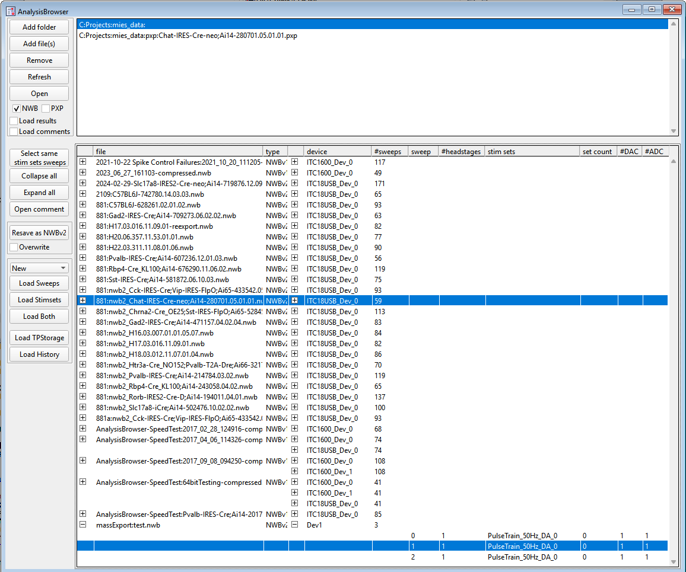

.. _analysisbrowser:

AnalysisBrowser
===============

The AnalysisBrowser allows browsing and loading acquired data from Igor Experiment files
(pxp and uxp) and NeuroDataWithoutBorders files (NWB, v1 and v2) into one Igor
Experiment. The user can also combine sweeps from multiple experiments in one
SweepBrowser, see :ref:`DataBrowser`, inspect the labnotebook entries of these
sweeps and view the :ref:`TPStorage` data.

.. _Figure Analysis Browser panel:

   AnalysisBrowser panel

Known Limitations
-----------------

If the experiment file contains acquisitions from multiple devices, e.g. ITC18 and Dev1 then for NWBv1 and NWBv2 files
an under certain circumstances sweeps can not be loaded. The loading attempt results in an Asssertion where multiple waves with the same name are present in the experiment file.
This is related to `issue 978 <https://github.com/AllenInstitute/MIES/issues/978>`__ and
`issue 1710 <https://github.com/AllenInstitute/MIES/issues/1710>`__.
This limitation does not apply when loading sweeps from Igor Pro experiment files (pxp).
