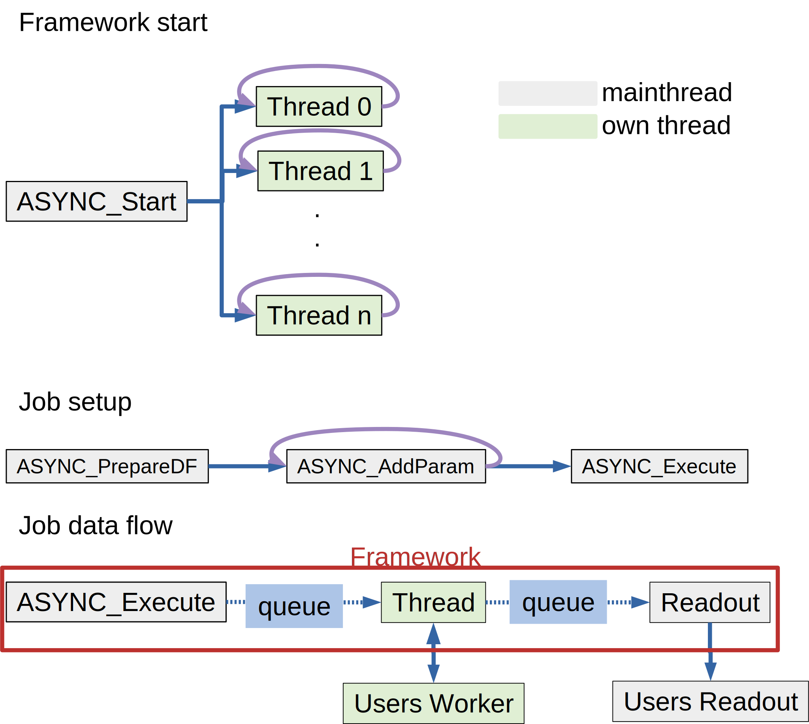

 .. _async_framework_doc:

===============
Async Framework
===============

Description
-----------

The Async Framework enables the user to execute code in parallel in separated
threads. The API reduces the efforts to accomplish parallel execution greatly
compared to the general approach Igor Pro provides.

For a specific job only two functions have to be implemented by the user of the
framework.

- A worker function that will be executed in a separate thread. It receives
  input data through a data folder. At the end it returns output data through
  another data folder to the main program.

- A ReadOut function that receives the output data and puts it back to the main programs data.

The frameworks API helps to setup an input data folder for workers. It also
supports running different jobs at the same time. By default the order of input
data send to a worker is tracked per job type. The associated readout function
is then called in the same order with the output data.

Though, if output in the same order as the input is not required there is also
an option to readout data just as worker functions output it.

Quick Guide
-----------

Start and Stop
~~~~~~~~~~~~~~

The framework is started by :cpp:func:`ASYNC_Start` that creates a given number
of threads that run in the background and wait for work.

 .. code-block:: igorpro

    ASYNC_Start(numThreads, disableTask)

By default a task is started that reads out data from finished workers in the
background. If this is not desired, setting the optional parameter
``disableTask=1`` prevents creation of the task. The user has to call :cpp:func:`ASYNC_ThreadReadOut`
themselves to retrieve data from finished workers.

In the end the framework can be stopped by :cpp:func:`ASYNC_Stop` that sends
all threads the request to abort. As there might be still input and/or output
data in the queue :cpp:func:`ASYNC_Stop` waits a given timeout to finish
processing. If timeout is reached further processing is stopped and the threads
are released.

 .. code-block:: igorpro

    ASYNC_Stop(timeout)

Creating of a job
~~~~~~~~~~~~~~~~~

The worker function for a job that the user has to implement must have the form

 .. code-block:: igorpro

    threadsafe Function/DF MyWorkerFunction(dfr)
      DFREF dfr

Input data is received in the data folder ``dfr``. As prepared by :cpp:func:`ASYNC_AddParam`
input objects such as variables, strings or waves are named ``param0``, ``param1``,
``param2`` and so on. The input data folder contains a variable ``paramCount`` that
stores the number of available *param* objects.

The function has to return a data folder reference to the data folder containing
the output data. The readout function will receive this data.

If no or an invalid data folder reference is returned the readout function
receives an empty data folder. This happens as well, if the worker aborts with a
runtime error.

The readout function must have the form

 .. code-block:: igorpro

    Function MyReadOutFunction(dfr, err, errmsg)
      DFREF dfr
      variable err
      string errmsg

Output data from the associated worker is received in the free data folder ``dfr``.
The readout function should put the result data back to the main threads data.

By default *err* contains the return code of the worker and *errmsg* is emtpy. If
the worker aborts prematurely with a runtime error, *err* contains the runtime error
code and *errmsg* the corresponding error message.

By default :cpp:func:`ASYNC_Start` creates a background task that automatically
calls the users readout function when output data is received from workers.

Preparing and executing a job
~~~~~~~~~~~~~~~~~~~~~~~~~~~~~

Input data for the worker is given through a free data folder that is created by

 .. code-block:: igorpro

    DFREF threadDF = ASYNC_PrepareDF("WorkerFunction", "ReadOutFunction", inOrder)

The :cpp:func:`ASYNC_PrepareDF` function returns a reference to a prepared data
folder. WorkerFunction and ReadOutFunction are the function names of worker and
readout this job type.

A job type is defined by the combination of the names of the worker function and
ReadOut function. For a job type the readout function gets called in the same
order as the jobs were executed.

Setting the optional parameter ``inOrder=0`` allows to process read outs as soon
as output data arrives from the worker function.

Input data for the worker is added with :cpp:func:`ASYNC_AddParam` :

 .. code-block:: igorpro

    ASYNC_AddParam(threadDF, w=wave, var=variable, str=string, move=0)

Either a variable, string or wave can be added to the data folder per call. The
added data is put in order of addition as *param0*, *param1*, *param2* and so on into
the data folder.

By default waves are duplicated when put into the data folder. Setting the
optional parameter ``move=1`` moves the wave instead. It can only be used with
waves.

It is possible to vary the number of input parameters for the same job type.
As the worker function can read ``paramCount`` from its input data folder the
user is able to handle different input data setups in the worker.

If all desired input data was added the job is started by calling :cpp:func:`ASYNC_Execute`

 .. code-block:: igorpro

    ASYNC_Execute(threadDF)

The function takes the prepared data folder as input and puts it into the queue
for the workers. The registered worker will receive the input data and execute
in parallel. After the worker finishes its output data is queued to be received
by the registered readout function.

Job types and execution order
~~~~~~~~~~~~~~~~~~~~~~~~~~~~~

The job type is defined by the combination of worker function name and
readout function name. The following code creates input data folders for two
different job types.

 .. code-block:: igorpro

    DFREF threadDF1 = ASYNC_PrepareDF("Worker1", "ReadOut1")

    DFREF threadDF2 = ASYNC_PrepareDF("Worker2", "ReadOut2")

Any number of job types can be executed with :cpp:func:`ASYNC_Execute` .
Their respective worker functions will be executed by the threads in parallel.
All jobs are scheduled in the order they were queued by :cpp:func:`ASYNC_Execute`
independent of their respective type.

By default the Async framework tracks the order of jobs as they are queued by
:cpp:func:`ASYNC_Execute` per job type. The associated readout functions are
called in the same order. If a newer job finishes earlier, the jobs output data
is buffered by the framework until it is the jobs turn to be readout.

Execution of jobs with different types and in-order or without ordered
readout can be mixed.

Details on Stopping Threads
~~~~~~~~~~~~~~~~~~~~~~~~~~~

When calling :cpp:func:`ASYNC_Stop` all threads are requested to quit after
their current worker finished. The stop process runs through the following
stages:

- quit of thread(s) after worker(s) finish(es) is issued
- within timeout time, remaining readouts are processed in main thread
- within timeout time, ThreadGroupWait sets the Igor internal abort flag for all threads
- previous stages finished or after timeout: ThreadGroupRelease releases all threads

If a worker is still running when the main thread issues ThreadGroupRelease in
Igor Pro 8 the thread is killed including all data in the queue. In Igor Pro 7
a 'virtual' runtime error is injected into the thread. The threading loop for
the workers from the Async framework catches this runtime error and quits the
thread gracefully. This kind of behavior in Igor Pro 7 requires to introduce an
additional rule for worker functions that use try-catch-endtry itself. If a
runtime error is caught in a worker the worker has to check the code without
deleting the error state. If the code is zero the worker has to return to the
threading loop.

.. code-block:: igorpro
   :caption: Igor Pro 7 try-catch-endtry worker example

   try
     subworker()
   catch
     if(!getRTError(0))
       return 0
     endif
     // further error handler
   endtry

Depiction of frameworks working principle.

Code example
------------

.. code-block:: igorpro
   :caption: Code example

   Constant NUMBER_OF_JOBS = 200

   Function AsyncExample(inOrder)
     variable inOrder

     variable i

     // Start Async FrameWork
     ASYNC_Start(ThreadProcessorCount)

     // Some data
     Make/O/N=(NUMBER_OF_JOBS) data = 31337

     // We want to setup NUMBER_OF_JOBS workers to run
     for(i = 0;i < NUMBER_OF_JOBS; i += 1)

       // Prepare a thread df
       DFREF threadDF = ASYNC_PrepareDF("Worker", "ReadOut", inOrder=inOrder)
       // Add param0 which is a numeric variable that counts executed jobs
       ASYNC_AddParam(threadDF, var=i)
       // Add param1 which is a numeric wave
       ASYNC_AddParam(threadDF, w=data, move=0)

       // Add param2 which is a numeric wave that is moved
       Make/O/N=(NUMBER_OF_JOBS) moredata = 31337
       ASYNC_AddParam(threadDF, w=moredata, move=1)

       ASYNC_Execute(threadDF)
     endfor
     ASYNC_Stop()
   End

   // example worker function
   threadsafe Function/DF Worker(dfr)
     DFREF dfr
     // dfr is the input data folder

     // create a data folder for output data
     DFREF dfrOut = NewFreeDataFolder()

     variable i, j
     string s

     // lets assume there happens a runtime error each 50 jobs
     // get our job counter
     NVAR wID=dfr:param0
     if(!mod(wID, 50))

       WAVE w = $""
       w[0] = 0

     endif

     // some processing that has a random runtime
     variable runtime = abs(floor(gnoise(1))) * 10
     for(i = 0; i < runtime; i += 1)
       // waste some time
       for(j = 0; j < 100; j += 1)
         s = num2str(i)
       endfor
     endfor

     // Get input parameter references
     NVAR/SDFR=dfr param0 // was i
     WAVE/SDFR=dfr param1 // was data
     WAVE/SDFR=dfr param2 // was moredata
     // process wave
     param2[param0] += param0

     // put counter in output data
     variable/G dfrOut:counter = param0
     // Move processed wave to output DF
     MoveWave param2, dfrOut:outWave

     return dfrOut
   End

   // example readout function
   Function ReadOut(dfr, err, errmsg)
     DFREF dfr
     variable err
     string errmsg

     if(err)
       // Insert error handling here
       print "error caught code: " + num2str(err) + "\r" + errmsg
     else
       // do the readout here
       WAVE/SDFR=dfr outWave
       NVAR counter = dfr:counter
       if(outWave[counter] != 31337 + counter)
         print "Processing by worker yielded unexpected result"
       endif
     endif
   End
