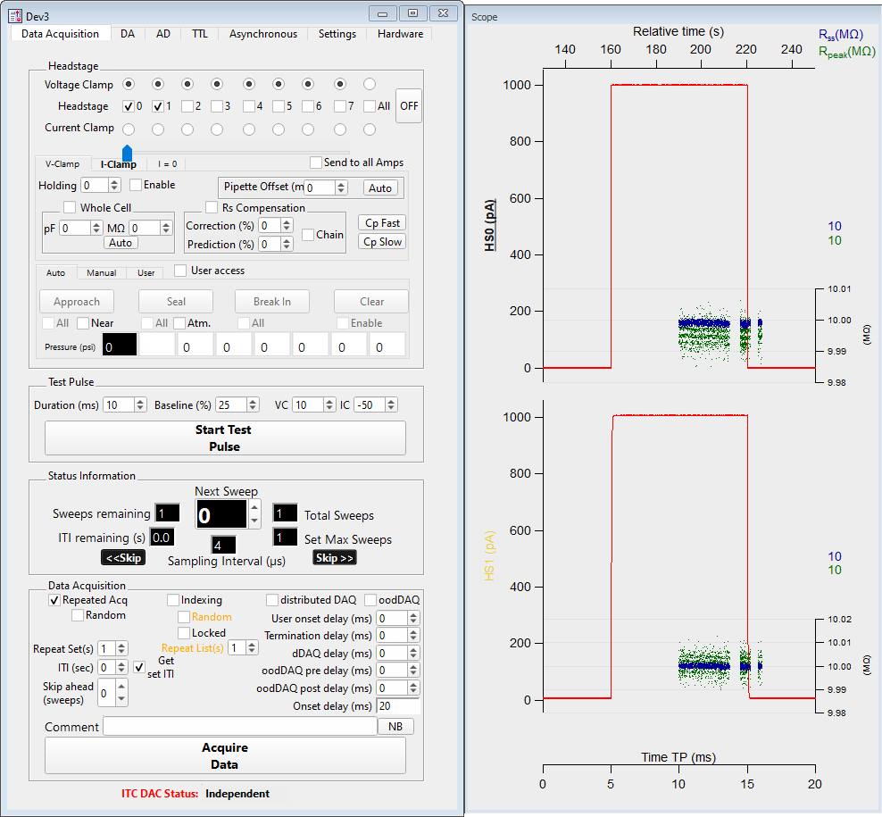

.. _daephys:

Da_Ephys
========

The DA_Epys panel centralizes control of data acquisition, including multiple
hardware components necessary for performing electrophysiology experiments,
such as the DAC, amplifier, and pressure regulators.

.. _Figure DA Ephys panel:

   Main data acquisition panel

TODO fill me

.. _daephys_oodDAQ:

Optimized overlap distributed DAQ (oodDAQ)
~~~~~~~~~~~~~~~~~~~~~~~~~~~~~~~~~~~~~~~~~~

TODO fill me

.. _daephys_dDAQ:

Distributed DAQ (dDAQ)
~~~~~~~~~~~~~~~~~~~~~~~~

TODO fill me
