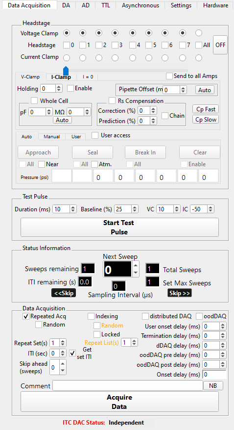

.. _daephys:

Da_Ephys
========

The DA_Epys panel centralizes control of data acquisition, including multiple
hardware components necessary for performing electrophysiology experiments,
such as the DAC, amplifier, and pressure regulators.

.. _Figure DA Ephys panel:

   Main data acquisition panel

The main data acquisition panel centralizes and simplifies manual control of
the amplifier, pressure control, test-pulse, and data acquisition for up to 8
headstages. For headstage dependent controls, the slider determines which
headstage to apply user input.

.. _daephys_dDAQ:

Distributed DAQ (dDAQ)
~~~~~~~~~~~~~~~~~~~~~~~~

dDAQ simplifies the acquisition of synaptic responses during paired recordings.
In paired recordings, each cell can be pre- and postsynaptic. dDAQ distributes
the stimulus set sweep in time across headstages. Temporal distribution the
stimulus set sweep ensures that the postsynaptic cell isn't being stimulated
simultaneously with the presynaptic cell, which would obscure any synaptic
response(e.g., PSP, PSC). dDAQ delay inserts an acquisition time delay between
the stimulus set sweeps on each headstage. dDAQ automatically adapts as
headstages are enabled or disabled during data acquisition.

.. figure:: svg/dDAQ-delay.svg
   :align: left

.. _daephys_oodDAQ:

Optimized overlap distributed DAQ (oodDAQ)
~~~~~~~~~~~~~~~~~~~~~~~~~~~~~~~~~~~~~~~~~~

oodDAQ simplifies and speeds the acquisition of synaptic responses during
paired recordings. In paired recordings, each cell can be pre- and
postsynaptic. oodDAQ distributes the non-zero epochs of the stimulus set sweep
in time across headstages. Temporal distribution of non-zero regions of the
stimulus set sweep ensures that the postsynaptic cell isn't being stimulated
simultaneously with the presynaptic cell, which would obscure any synaptic
response(e.g., PSP, PSC). oodDAQ pre- and post-delay extend the region of
non-overlap to include zero regions around the non-zero region. These delays
ensure the synaptic response can complete before the cell is stimulated to
elicit a (presynaptic) action potential. Pre- and post-delay are highly
recommended when the stimulus set sweep contains pulse trains. To maintain
optimal stimulus distribution, oodDAQ automatically adapts if headstages are
enabled or disabled during data acquisition.

.. figure:: svg/oodDAQ-delays.svg
   :align: left
