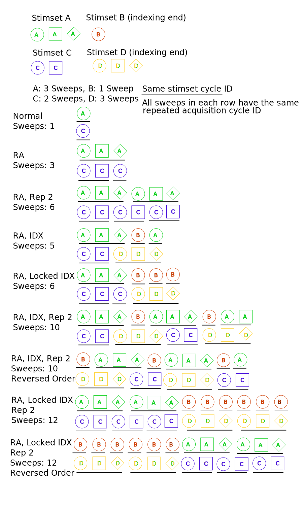
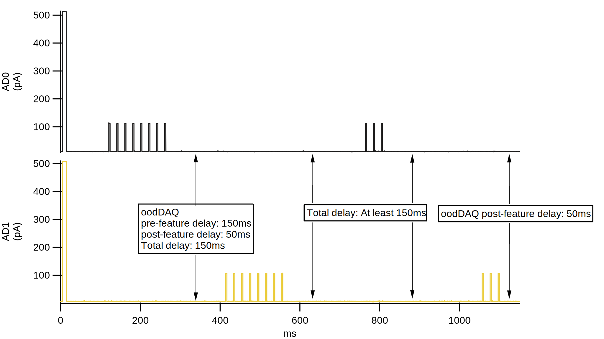

DAQ details
===========

.. _Figure Repeated Acquisition Explained:

   Data acquisition modes

.. _Figure Normal Delays:

.. figure:: svg/normal-delays.svg
   :align: center

   Normal delays

.. _Figure dDAQ Delays:

.. figure:: svg/ddaq-delay.svg
   :align: center

   Ddaq delay

.. _Figure oodDAQ Delays:

   oodDAQ delays

.. _Figure Testpulse Visualization:

.. figure:: svg/testPulse-visualization.svg
   :align: center

   Testpulse visualization

Indexing definition
-------------------

MIES has different modes to automate the acquisition of multiple stimulus sets.

Indexing mode allows the acquisition of a range of stimulus sets across multiple channels and channel types (DA and TTL).

As stimulus sets can have a different number of sweeps, the natural question
arises when to switch to the next stimulus set when acquiring data on multiple
channels simultaneously. Locked indexing advances to the next stimulus set when
the stimulus set with the most sweeps (currently acquiring, not globally) on
all active channels is complete. Unlocked indexing advances to the next
stimulus set on an individual channel when the active set on the same channel
is complete. In both modes, the currently active set may automatically repeat
while acquisition on the channel with the most combined sweeps proceeds to
completion; locked indexing repeats and then indexes, while unlocked indexing
indexes and then repeats.

Inner-Set randomization is currently broken with indexing.

Set randomization with indexing is not implemented.
