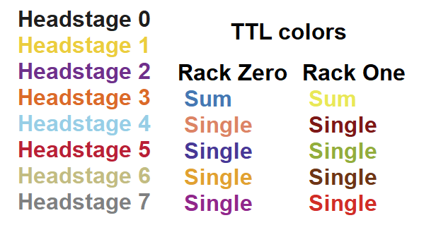

.. _databrowser:

DataBrowser
-----------

.. toctree::
  :maxdepth: 1

  databrowser_paplot
  databrowser_overlaysweeps
  databrowser_channelselection
  databrowser_settings
  databrowser_sweepcontrol

The DataBrowser allows the user to view acquired sweeps and metadata during and
after an experiment. It has several display modes that facilitate recording
from multiple channels simultaneously. Users may also manipulate and analyze
(automatically backed up) data using a built-in custom scripting language that
includes general and specialized electrophysiology functions.

.. todo: fillme

.. _Figure Relevant Colors:

Relevant Colors
"""""""""""""""

   Color scheme used throughout the DataBrowser and other panels which display information
