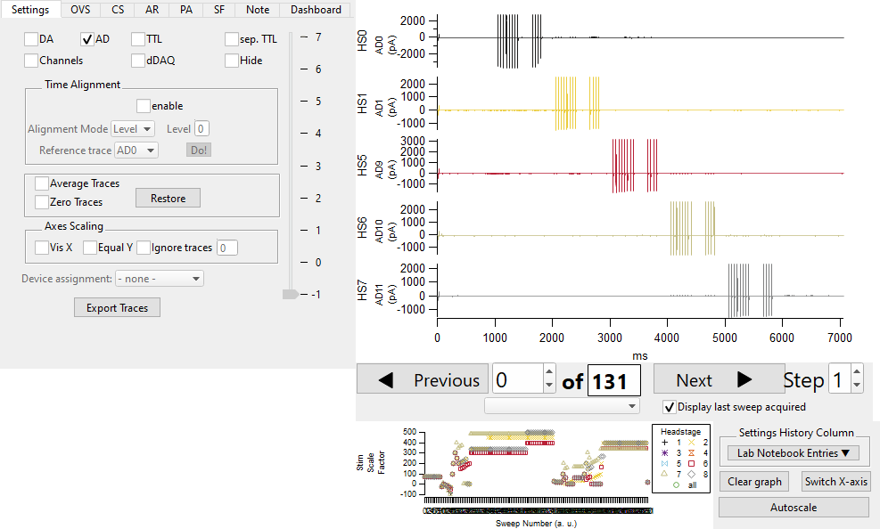

.. _DataBrowser:

DataBrowser
-----------

.. toctree::
  :maxdepth: 1

  databrowser_settings
  databrowser_overlaysweeps
  databrowser_channelselection
  databrowser_artefactremoval
  databrowser_paplot
  databrowser_sweepformula
  databrowser_note
  databrowser_dashboard
  databrowser_sweepcontrol
  databrowser_settingshistory

The DataBrowser allows the user to view acquired sweeps and metadata during and
after an experiment. It has several display modes that facilitate recording
from multiple headstages simultaneously. Users may also manipulate and analyze
(automatically backed up) data using a built-in custom scripting language that
includes general and specialized electrophysiology functions see :ref:`SweepFormula`.

The following figure shows the DataBrowser with all three subpanels. The main
graph to the top right visualizes the currently selected sweep(s), either via
the controls in :ref:`db_sweepcontrol` or via :ref:`db_overlaysweeps`. The
controls on the left, :ref:`db_settings`, tune the display behaviour, and the
remaining tabs allow more fine-grained and specialized control for
visualization and data evaluation. See the corresponding sub-pages at the top
of this page. The bottom most panel, :ref:`db_settings_history`, allows to
visualize labnotebook entries.

   DataBrowser with all subwindows

For better readability we have a fixed color scheme for the acquired data, most notably the headstages.

.. _Figure Relevant Colors:

Relevant Colors
"""""""""""""""

.. figure:: ScreenShots/RelevantColors.png
   :align: center
   :width: 50%

   Color scheme used throughout the DataBrowser and other panels which display
   headstage and channel dependent information

SweepBrowser vs DataBrowser
"""""""""""""""""""""""""""

We only speak about the DataBrowser here, but nearly everything also applies to the
SweepBrowser. Exceptions are mentioned explicitly.

The DataBrowser is used when viewing sweeps during acquisition and when they
are from the currently open Igor Pro experiment. The SweepBrowser is started from the
:ref:`AnalysisBrowser` and can be used to browse acquired sweeps loaded from
PXP and NWB files.
