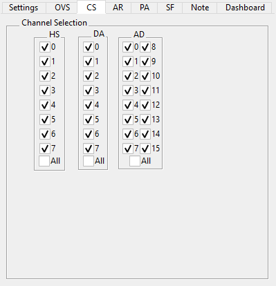

.. _db_channelselection:

Channel Selection
~~~~~~~~~~~~~~~~~

The CS tab allows selecting the displayed headstages, DA and AD channels.
It applies to all sweeps shown in the databrowser. The ``All`` checkbox allows
toggling the display of all in one click.

.. _Figure Pulse Average Channel Selection:

   Tab for selecting the displayed Headstages and Channels
