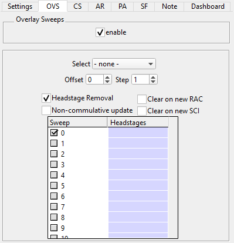

.. _db_overlaysweeps:

Overlay Sweeps
~~~~~~~~~~~~~~

The OVS tab allows to overlay multiple sweeps in the same graph. The
selection of the sweeps can be done by criteria like stimsets, clamp mode or
similiar, using a step and offset calculation based on sweep numbers, or by
selecting them from the listbox. Ignoring selected headstages of a specific
sweep when overlaying is supported as well.

The following section describe the OVS settings.

.. _Figure Overlay Sweeps:

   Settings for overlaying sweeps

- ``Enable``: Toggle the overlay sweeps mode. When turned on, all selected
  sweeps in the lower list box are displayed. In the off state, only the sweep
  selected in :ref:`Figure Databrowser Sweep Control` will be shown.
- ``Select``: Select multiple sweeps based on criteria like stimulus set (DA
  and TTL) and clamp mode. Includes also ``None`` for unselecting all of them.
- ``Offset`` and ``Step``: Select every sweep number :math:`x` which satisfies
  the condition :math:`x = o + n \cdot s` where :math:`o` is the ``Offset``,
  :math:`s` the ``Step`` and :math:`n >= 0` an integer.
- ``Headstage Removal``: Toggle the ignoring of headstages. When an existing
  headstage is entered in the second column in the listbox, this headstage will
  not be displayed in the Databrowser. Headstages can also be selected
  interactively from the context menu in the Databrowser. For this hover over
  the trace you want to remove, right-click and select ``Ignore Headstage in Overlay Sweeps``.
- ``Non-commulative update``: If you have enabled ``Display last sweep acquired``
  in :ref:`Figure Databrowser Sweep Control` this option will remove the
  previous last sweep from the list of overlayed sweeps before adding the newly
  acquired sweep.
- ``Clear on new RAC``: Clear the list of overlayed sweeps when a new repeated acquisition cycle (RAC) starts.
- ``Clear on new SCI``: Same approach but this time based on the stimset cycle (SCI).
- ``Listbox``: The listbox allows to select which sweeps to overlay
  individually. The first colum has the sweep numbers and the second column
  holds the headstages for removal. The ``Headstages`` column can only be
  edited when ``Headstage Removal`` is checked. The headstages to be removed
  can be single headstages ``0`` to ``7``, list of headstages ``0;2;6`` or a
  range ``0-2``.
