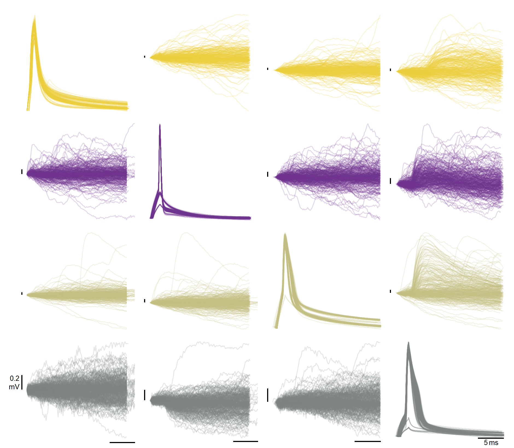
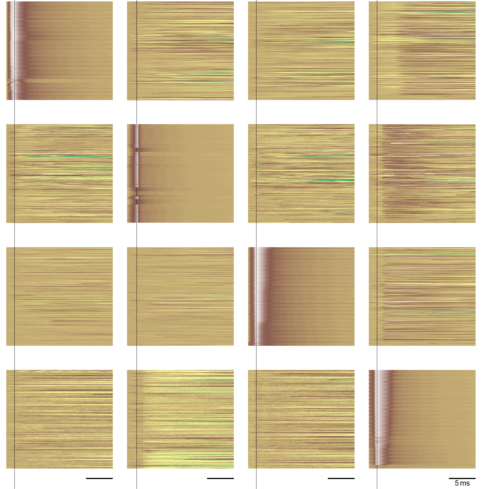
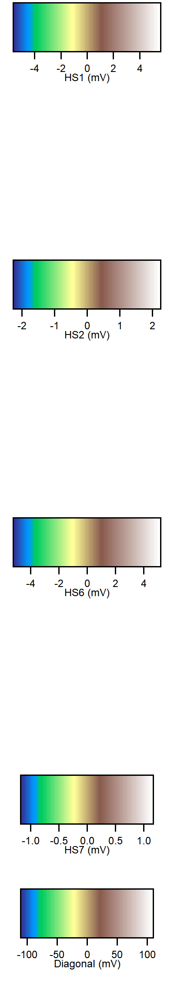
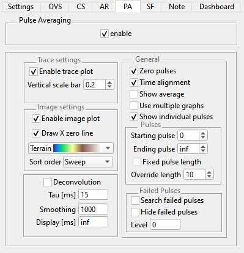

.. _db_paplot:

Pulse Average (PA) plot
=======================

The purpose of the pulse averaging (PA) plot is to identify synaptic
connections by pooling (via time alignment) and averaging the responses within
and across sweeps to pulses (intended to produce action potentials) on a single
headstage. It repeats this process for all headstages with pulses (action
potentials).

Although the stimulus set will contain :ref:`wavebuilder_pulsetrain` epochs in
most cases, the pulse extraction algorithm works with all epoch types and
special measurement modes like :ref:`daephys_dDAQ` or :ref:`daephys_oodDAQ`.

The dDAQ slider from the :ref:`db_settings` tab is respected as is the :ref:`db_channelselection`.

For instructional purposes, assume pulse train acquisition on four different
headstages with oodDAQ (to distribute the pulses in time, across headstages).
The PA plot shows AD data from each headstage and will have 16 (4 rows x 4
columns) PA sets (either in 16 plots on a single graph or 16 individual graphs;
user-defined).

To gather PA sets for a column of (4) sets, pulse timing data from a DA channel
(of a headstage) are used time-align AD regions for each active headstage. A
row (of sets) is from the same AD channel of a headstage and uses regions
determined by unique DA channels e.g., the top left set of traces is from the
AD channel of the first active headstage, time aligned by the DA channel of the
first active headstage. The set immediately to the right of the top left set of
traces, is from the the same AD channel, time aligned by the DA channel on the
next active headstage.

The following two figures, :ref:`Figure Pulse Average Trace plot` and
:ref:`Figure Pulse Average Image plot`, were created with multiple sweeps
overlayed, see :ref:`db_overlaysweeps`, and time alignment and zeroing turned on.

.. _Figure Pulse Average Trace plot:

Trace plot
""""""""""

   Trace plot

The trace plot displays data in each PA set as voltage or current time-series.
Scale bars, shown in black, are provided for each y axes and for each column's
shared x (time) axes. PA trace colors match databrowser trace colors and encode
the headstage, see also :ref:`Figure Relevant Colors`.

.. _Figure Pulse Average Image plot:

Image plot
""""""""""

.. raw:: html

   
&nbsp;&nbsp;&nbsp; 

The image graph supplements the trace plot :ref:`Figure Pulse Average Trace
plot`. It renders more quickly than the trace plot, especially with many
(overlayed) sweeps. Each (horizontal) line of the image plot corresponds to a
pulse (unique time-series) and encodes the voltage or current in color
(user-defined color mapping). Deconvolution and average lines (extra wide) are
at the bottom of each set image. Image-space is left blank when data is not
shown. The image is filled from bottom to top depending on the
:ref:`db_paplot_image_sortorder`.

.. _db_paplot_image_sortorder:

Sort Order
^^^^^^^^^^

The following tables visualizes the display of one image set with two sweeps
overlayed and three pulses using different ``Sort Order`` settings. The
ordering is always ascending and from bottom to top. Due to implementation
details the ``Sweep`` sort order allows **much** faster incremental updates
(only relevant during data acqisition).

.. table:: Comparing different sort orders

   +----------------+----------------+
   | Sweep          | Pulse          |
   +================+================+
   |Pulse 2, Sweep 1|Pulse 2, Sweep 1|
   +----------------+----------------+
   |Pulse 1, Sweep 1|Pulse 2, Sweep 0|
   +----------------+----------------+
   |Pulse 0, Sweep 1|Pulse 1, Sweep 1|
   +----------------+----------------+
   |Pulse 2, Sweep 0|Pulse 1, Sweep 0|
   +----------------+----------------+
   |Pulse 1, Sweep 0|Pulse 0, Sweep 1|
   +----------------+----------------+
   |Pulse 0, Sweep 0|Pulse 0, Sweep 0|
   +----------------+----------------+
   |Deconvolution   |Deconvolution   |
   +----------------+----------------+
   |Average         |Average         |
   +----------------+----------------+

.. _db_paplot_timealignment:

Time Alignment
^^^^^^^^^^^^^^

Time alignment removes the pulse to pulse jitter in pulse evoked event (action potential) timing.

The algorithm is as follows:

- Get the feature position ``featurePos`` for all pulses which belong to the
  same set. Store these feature positions using their sweep number and pulse
  index as key.
- Now shift all pulses in all sets from the same region by ``-featurePos``
  where ``featurePos`` is used from the same sweep and pulse index.

.. _db_paplot_operation_order:

Operation order
^^^^^^^^^^^^^^^

Data operations occur in the following (fixed) order:

- Gather pulses
- Pulse sorting
- Failed pulse search
- Zeroing
- Time alignment
- Averaging

PA plot settings
^^^^^^^^^^^^^^^^

The following sections describe PA settings. Settings are configured on the
data browser PA settings tab (shown below).

.. _Figure Pulse Average Browser Settings:

   Settings for the pulse average plot

Pulse Averaging
"""""""""""""""

- ``enable``: Toggle the display of the PA image/trace plots.
   To adjust multiple settings at-a-time, disable the PA plot, adjust settings, and re-enable.

Image settings
""""""""""""""

- ``Enable image plot``: Toggle the display of the :ref:`Figure Pulse Average Image plot`
- ``Draw X zero line``: Draws vertical line at ``X == 0`` in each column. Requires time alignment
   (see below). Facilitates measurement of event latency.
- ``Popup Menu``: Color scheme for image plots
- ``Sort order``: Sort order of the displayed pulses. For ``Sweep`` the pulses are
  first ordered by sweep number and then by pulse index. For ``Pulse`` it is
  first pulse index and then sweep number. See also
  :ref:`db_paplot_image_sortorder`.

Trace settings
""""""""""""""

- ``Enable trace plot``: Toggle the display of the :ref:`Figure Pulse Average Trace plot`.
- ``Vertical scale bar``: Size of the vertical scale bar in y-axis units

Deconvolution
"""""""""""""

- ``Deconvolution``: Enables deconvolution [#1]_ of the average pulse.
  Deconvolution trace is displayed with the average trace in the trace plot and
  immediately above the average line in the image plot.
- ``Tau [ms]``: Time constant [#2]_
- ``Smoothing``: Smoothing parameter, use ``1`` to disable smoothing
- ``Display [ms]``: Time range of the average pulse used for the deconvolution, use ``inf`` to use the full range

General
"""""""

- ``Zero pulse``: Toggle Pulse Zeroing. Zeroing is carried out by
  differentiation, followed by the integration of each pulse.
- ``Time alignment``: Toggle time alignment of pulses from one column. See
  :ref:`db_paplot_timealignment` for an in-depth explanation.
- ``Show average``: Toggle average pulse display. For the image plot, the
  average is the bottom-most row. Failed pulses (see below) are not included
  in the average.
- ``Use multiple graphs``: Creates a panel for each PA set. Normally, multiple
  PA sets are distributed onto a single panel.
- ``Show individual pulses``: Enables the display of individual pulses. Turning
  that off can increase the display update performance. The average and
  deconvolution are still shown if enabled.

Pulses
""""""

Select a subset of the pulses from a train of pulses (contained within a sweep).

- ``Starting pulse``: First pulse index to display, 0-based.
- ``Ending pulse``: Last pulse index to display, use ``inf`` to use the last pulse.
- ``Fixed pulse length``: Choose the calculation method of the pulse lengths.
  When unchecked the pulse length is calculated as the average pulse length
  from the extracted pulses. When checked the ``Override length`` is used.
- ``Override length``: Pulse length to use when no length can be calculated
  [#3]_ or when ``Fixed pulse length`` is checked

Failed Pulses
"""""""""""""

Pulse responses may be filtered by their amplitude.

- ``Search failed pulses``: Toggle the failed pulse search
- ``Hide failed pulses``: When a pulse failed, hide instead of highlight.
- ``Level``: Level in y-data units to search for failed pulses. Every pulse not
  reaching that level is considered failing. As mentioned in
  :ref:`db_paplot_operation_order` that search is done before zeroing.

.. [#1] See `doi:10.1152/jn.00942.2007 <https://www.physiology.org/doi/full/10.1152/jn.00942.2007>`__ for the implemented method
.. [#2] The following equation holds:
.. math:: \tau \cdot \frac{dV}{dt} + V = f
.. [#3] Pulse length cannot be calculated when a sweep contains a single pulse
   or when the pulse length is variable, e.g., ``Poisson distribution`` from the
   ``Pulse Train`` stimulus epoch type.
