Developer
=========

Getting MIES
------------

Latest development version from main branch
~~~~~~~~~~~~~~~~~~~~~~~~~~~~~~~~~~~~~~~~~~~~~

-  ``git clone https://github.com/AllenInstitute/MIES``
-  ``./tools/initial-repo-config.sh`` (Requires a Git Bash shell, named
   Git terminal in SourceTree)

Arduino
-------

Setup
~~~~~

Advanced measurement modes like Yoking require an Arduino for triggering
the DAC hardware. The following steps have to be performed in order to
get a working setup:

-  Get an `Arduino
   UNO <https://www.arduino.cc/en/Main/ArduinoBoardUno>`__, for easier
   PIN access a `screw
   shield <http://www.robotshop.com/en/dfrobot-arduino-compatible-screw-shield.html>`__
   comes in handy too
-  Connect the device to the PC via USB
-  Install the Arduino studio from
   "Packages\\Arduino\\arduino-1.6.8-windows.exe"
-  Extract "Packages\\Arduino\\Arduino-libraries-and-sequencer.zip" into
   "C:\\Users\\$username\\Documents\\Arduino"
-  Start Arduino studio and try connecting to the device
-  Load and compile the installed sequence "Igor\_Sequencer3.ino"
-  Connect Pin 12 and GND to the trigger input of the DAC hardware

Usage
~~~~~

-  Connect Arduino
-  Start Arduino studio and upload "Igor\_Sequencer3.ino"
-  Start Igor Pro
-  Open the panel from the Arduino menu
-  Connect
-  Upload Sequence
-  The start of DAQ is done by MIES itself

Building the documentation
~~~~~~~~~~~~~~~~~~~~~~~~~~

(Currently only tested on Linux.)

- Install `Docker <https://docker.io>`__
- Execute ``tools/docker/build-documentation.sh``

Updating documentation
~~~~~~~~~~~~~~~~~~~~~~

Due to our excessive use of the breathe sphinx extension which feeds from
doxygen, a full documentation build takes around 10 minutes. It is also not
possible to use the sphinx autobuild feature, as it rebuilds all everything from
scratch due to breathe.

For fast read-write-view cycles while writing the user documentation do the following:

- Start with a clean ``Packages/doc`` folder
- Apply the :download:`patch <0001-WIP-fast-sphinx-rst-update-cyle.patch>`
  which temporarily removes breathe via ``git am ...``
- Call ``make autobuild`` which opens a local webbrowser and rebuilds after
  every change. This time incremental updates work.

Release Handling
----------------

If guidelines are not followed, the MIES version will be unknown, and
data acquisition is blocked.

Cutting a new release
~~~~~~~~~~~~~~~~~~~~~

-  Checkout the main branch
-  Paste the contents of ``Packages\doc\releasenotes_template.rst`` to
   the top of ``Packages\doc\releasenotes.rst``
-  Call ``tools\create-changelog.sh`` which generate a raw changelog and
   fill ``releasenotes.rst`` with a cleaned up version of it.
-  Tag the current state with ``git tag Release_X.Y_*``, see ``git tag``
   for how the asterisk should look like
-  Push the tag: ``git push origin $tag``. You can pass ``--dry-run`` for
   testing out what is getting pushed without pushing anything.
-  Create the release branches:

   -  ``git checkout -b release/X.Y``
   -  ``git push --no-verify -u origin release/X.Y``

-  Change the bamboo plans using release branches to use the branch
   release/X.Y
-  Create a new release on github and check that the bamboo job correctly
   uploads the artifacts

Creating a release package manually
~~~~~~~~~~~~~~~~~~~~~~~~~~~~~~~~~~~

-  Open a git bash terminal by choosing Actions->"Open in terminal" in
   SourceTree
-  Checkout the release branch ``git checkout release/$myVersion``
-  If none exists create one with ``git checkout -b release/$myVersion``
-  Change to the ``tools`` directory in the worktree root folder
-  Execute ``./create-release.sh``
-  The release package including the version information is then
   available as zip file

Continuous integration server
-----------------------------

Our `CI server <http://bamboo.corp.alleninstitute.org/browse/MIES>`__,
called bamboo, provides the following services for MIES:

Automatic release package building
~~~~~~~~~~~~~~~~~~~~~~~~~~~~~~~~~~

-  The release branch, ``release/$number`` with the highest ``$number``,
   is polled every 3 minutes for changes
-  If changes are detected, a clone is fetched, and inside a checked out
   git working tree, the release script ``tools/create-release.sh`` is
   executed.
-  The result of the release script, called an artifact in CI-speech, is
   then available as zip package from the `Package
   section <http://bamboo.corp.alleninstitute.org/browse/MIES-RELEASE/latestSuccessful>`__.
-  The release packaging job can be run on a windows box with git for windows installed.
   This is ensured by a platform requirement for the job.

Compilation testing
~~~~~~~~~~~~~~~~~~~

The full MIES installation and the partial installations are IGOR Pro
compiled using a bamboo job. This allows to catch compile time errors
early on. For testing compilation manually perform the following steps:

-  Create in ``User Procedures`` a shortcut pointing to
   ``Packages\MIES_Include.ipf`` and ``Packages\unit-testing``
-  Remove the shortcut ``Packages\MIES_Include.ipf`` in
   ``Igor Procedures``
-  Close all Igor Pro instances
-  Execute ``tools\unit-testing\check_mies_compilation.sh``
-  Watch the output

Unit testing
~~~~~~~~~~~~

One of the bamboo jobs is responsible for executing our unit tests. All
tests must be written using the `Igor Unit Testing
Framework <https://docs.byte-physics.de/igor-unit-testing-framework>`__ and
referenced in the main test experiment located in
``tools\unit-testing\RunAllTests.pxp`` For executing the tests manually
perform the followings steps:

-  Create in ``User Procedures`` a shortcut pointing to
   ``Packages\MIES_Include.ipf``, ``Packages\unit-testing`` and
   ``Packages\Testing-MIES``
-  Remove the shortcut ``Packages\MIES_Include.ipf`` in
   ``Igor Procedures``
-  Close all Igor Pro instances
-  Execute ``tools\unit-testing\autorun-test.bat``
-  Watch the output

Documentation building
~~~~~~~~~~~~~~~~~~~~~~

The documentation for the main branch is automatically built and
uploaded by `this <http://bamboo.corp.alleninstitute.org/browse/MIES-CM>`__ bamboo job.

Setting up a continous integration server (Linux)
~~~~~~~~~~~~~~~~~~~~~~~~~~~~~~~~~~~~~~~~~~~~~~~~~

Preliminaries
^^^^^^^^^^^^^

-  Linux box with fixed IP
-  Choose a user, here named ``ci``, for running the tests.
-  Make sure that the user is **not** a member of the ``wheel`` group so that
   it can not gain root access.
-  Install the bare-minimum packages and use the latest debian stable

Enable SSH access
^^^^^^^^^^^^^^^^^

-  Setup remote SSH access with public keys. On the client (your PC!)
   try logging into using SSH.
-  Disable password authentication in ``/etc/ssh/sshd_config``

Install required software
^^^^^^^^^^^^^^^^^^^^^^^^^

-  Install `Docker <https://docker.io>`__
-  Misc required software: ``apt install git cron-apt``
-  Enable automatic updates: ``echo "dist-upgrade -y -o APT::Get::Show-Upgraded=true" > /etc/cron-apt/action.d/4-upgrade``
-  Install OpenJDK 8 by adding a file with the following
   sources in ``/etc/apt/sources.list.d/``:

   .. code:: text

      deb https://adoptopenjdk.jfrog.io/adoptopenjdk/deb/ buster main

-  ``apt update``
-  ``apt install adoptopenjdk-8-hotspot-jre``
-  ``update-alternatives --config java`` and select version 8

Setup bamboo agent
^^^^^^^^^^^^^^^^^^

-  Install the bamboo agent according to the
   `instructions <http://bamboo.corp.alleninstitute.org/admin/agent/addRemoteAgent.action>`__
   and run it once to create the ``bamboo-agent-home`` directory
-  Create a file ``/etc/systemd/system/bamboo.service`` with the following contents

   .. code:: text

      [Unit]
      Description=Atlassian Bamboo
      After=syslog.target network.target

      [Service]
      Type=forking
      User=ci
      ExecStart=/home/ci/bamboo-agent-home/bin/bamboo-agent.sh start
      ExecStop=/home/ci/bamboo-agent-home/bin/bamboo-agent.sh stop
      SuccessExitStatus=143
      Environment="PATH=/home/ci/.local/bin:/usr/local/bin:/usr/bin:/bin"

      [Install]
      WantedBy=multi-user.target

-  Enable it with ``systemctl enable bamboo.service``
-  Reboot the system and check that the agent runs
-  Add a fitting ``Igor Pro (new)`` capability to the agent in bamboo.
-  Make the agent dedicated to the ``MIES-Igor`` project.
-  Be sure that the "git" capability and the "bash" executable capability are
   present as well

Setting up a continous integration server (Windows)
~~~~~~~~~~~~~~~~~~~~~~~~~~~~~~~~~~~~~~~~~~~~~~~~~~~

-  Windows 10 with "Remote Desktop" enabled user
-  Install the folllowing programs:

   -  Java 8
   -  Git (choose the installer option which will make the Unix tools
      available in cmd as well)
   -  Multiclamp Commander
   -  NIDAQ-mx driver package 19.0 or later
   -  NIDAQ-mx XOP from WaveMetrics
   -  HEKA Harware Drivers 2014-03 Windows.zip
   -  Igor Pro 8 (and a possible nightly version on top of it)
   -  Install bamboo remote agent according to
      http://bamboo.corp.alleninstitute.org/admin/agent/addRemoteAgent.action.

-  Start Igor Pro and open a DA\_Ephys panel, lock the device. This will
   not work, so follow the posted suggestions to get it working (registry fix and ASLR fix).
-  Add a fitting ``MIES_AgentType`` capability to the agent in bamboo.
-  Make the agent dedicated to the ``MIES-Igor`` project.
-  Be sure that the "git" capability and the "bash" executable capability are
   present as well
-  Create the folder ``$HOME/.credentials`` and place the file ``github_api_token`` from an existing CI machine there
-  Copy ``tools/start-bamboo-agent-windows.sh`` and ``tools/start-bamboo-agent-windows.bat`` to ``$HOME``
-  Edit ``tools/start-bamboo-agent-windows.bat`` so that it points to the existing Git location
-  Add shortcuts to ``$HOME/start-bamboo-agent-windows.bat`` and ``MC700B.exe`` into ``C:\ProgramData\Microsoft\Windows\Start Menu\Programs\StartUp``
- (Only for Code signing machine): Also add a shortcut to ``$HOME/start-bamboo-agent-windows.bat`` in the ``Startup`` folder

Available CI servers
~~~~~~~~~~~~~~~~~~~~

Distributing jobs to agents in bamboo is done via our ``MIES_AgentType`` capability.

The following capabilities are in use:

- ``Linux``: Two agents run on Linux with

  - Debian 10 (buster)
  - No Hardware
  - No Igor Pro
  - Docker

- ``CodeSigning``: Agent can sign installer packages

  - Windows 10
  - EV certificate on USB stick

- ``ITC``: Agent can execute hardware tests with ITC18USB hardware

  - ITC18-USB hardware, 2 AD/DA channels are looped
  - MCC demo amplifier only
  - Igor Pro (latest required versions)

- ``NI``: Agent can execute hardware tests with NI/ITC1600 hardware

  - ITC-1600 hardware with one rack, 2 AD/DA channels are looped
  - NI PCIe-6343, 2 AD/DA channels are looped
  - MCC demo amplifier only
  - Igor Pro (latest required versions)

Branch naming scheme
~~~~~~~~~~~~~~~~~~~~

For making code review easier we try to follow a naming scheme for branches behind PRs.

Scheme: ``$prefix/$pr-$text(-backport)?``

Where ``$prefix`` is one of ``feature``/``bugfix``, ``$pr`` is the number of the soon-to-be-created pull request and
``$text`` a user defined descriptive text. ``-backport`` must be present for PRs against release branches only.

Contributers are encouraged to install the ``pre-push`` git hook from the tools directory. The script
``tools/nextFreePRNumber.sh`` can get the soon-to-be-created PR number on the commandline (requires curl and jq) as well.

Continuous Integration Hints
~~~~~~~~~~~~~~~~~~~~~~~~~~~~

As part of the continuous integration pipeline tests are run. A full test run including the hardware tests
tales several hours. Thus, if a lot of pull requests are updated pending test runs could queue up and
it might take rather long until results are available.

Thus, for changes where the commits are in a state where no full test run by the CI makes sense it is
possible to inhibit the automatic tests. Typically this is the case if the developer commits changes
in progress and pushes these for the purpose of a secondary backup or further commit organization.
Inhibiting tests for these cases frees testing resources for other pull requests.

To inhibit test runs the key ``[SKIP CI]`` has to be added to the commit message.

The key can be removed later easily through a rebase with rewording the commit message.
After pushing to the repository the CI queues the tests again for this pull request.

Debugging threadsafe functions
~~~~~~~~~~~~~~~~~~~~~~~~~~~~~~

The function ``DisableThreadsafeSupport()`` allows to turn off threadsafe support globally. This allows to use the
debugger in threadsafe functions. Every MIES features which does not complain via ``ASSERT()`` or ``BUG()`` is supposed
to work without threadsafe support as well.

Preventing Debugger Popup
~~~~~~~~~~~~~~~~~~~~~~~~~

There exist critical function calls that raise a runtime error. In well-defined circumstances the error condition is evaluated properly afterwards.
When debugger is enabled and options are set to "Debug On Error", then the Debugger will popup on the line where such functions calls take place.
This is inconvenient for debugging because the error is intended and properly handled. To prevent the debugger to open the coding convention is:

.. code-block:: igorpro

   AssertOnAndClearRTError()
   CriticalFunction(); err = getRTError(1)

Notable the second part that clears the RTE must be in the same line and can not be moved to an own function.
This coding convention is only valid, if the critical function is expected to raise an runtime error.

Runtime Error / Abort Handling Conventions
~~~~~~~~~~~~~~~~~~~~~~~~~~~~~~~~~~~~~~~~~~

Here a coding convention for try / catch / endtry constructs is introduced to
prevent common issues like silently clearing unexpected runtime error conditions
by using these.

A try / catch / endtry construct catches by specification either

- Runtime errors when AbortOnRTE is encountered between try / catch
- Aborts when encountered between try / catch

The code must take into account the possibility of runtime errors generated
by bad code. These unexpected RTEs must not be silently cleared.

For the case, where an RTE is expected from CriticalFunction, the common approach is:

.. code-block:: igorpro

   AssertOnAndClearRTError()
   try
       CriticalFunction(); AbortOnRTE
   catch
       err = ClearRTError()
       ...
   endtry

Here pending RTEs are handled before the try. By convention the AbortOnRTE must be
placed in the same function as the try / catch / endtry construct.
The code between try / catch should only include critical function calls and be
kept minimal. The expected RTE condition should be cleared directly after catch.

For the case, where an Abort is expected from CriticalFunction, the common approach is:

.. code-block:: igorpro

   try
       CriticalFunction()
   catch
       ...
   endtry

As Abort does not generate an RTE condition the try / catch / endtry construct
leaves any possible unexpected RTE condition pending and no RTE condition is cleared.
The programmer might consider evaluating ``V_AbortCode`` after catch.

It is recommended to comment in the code before the try what the construct is
intended to handle (RTE, Abort or both).

Original Developer Docu on SweepFormula
~~~~~~~~~~~~~~~~~~~~~~~~~~~~~~~~~~~~~~~

Notebook scans from Matthias (`ukos-git`_):

.. _ukos-git: https://github.com/ukos-git

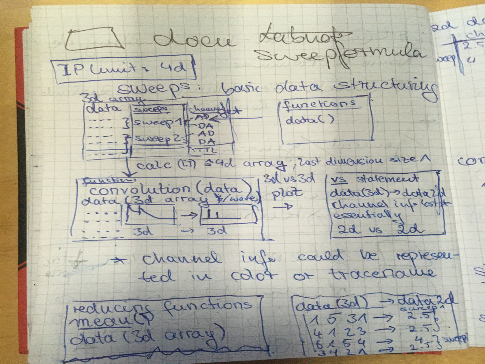

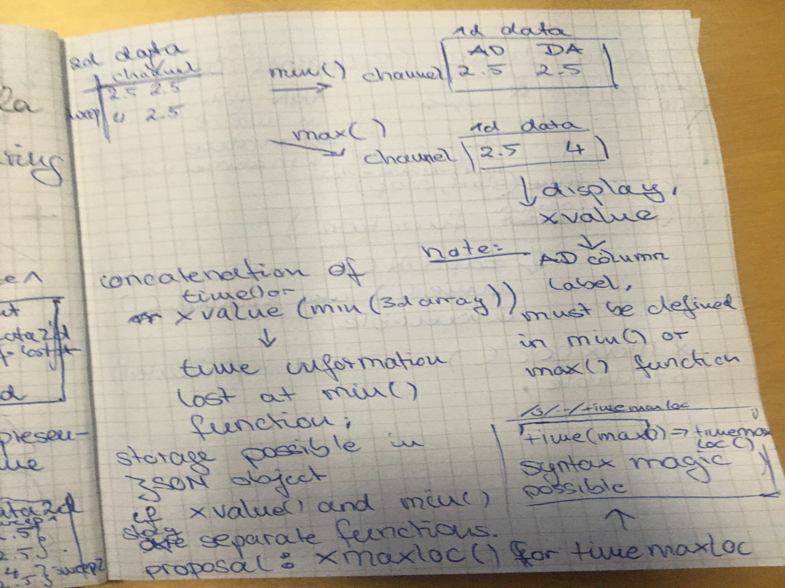

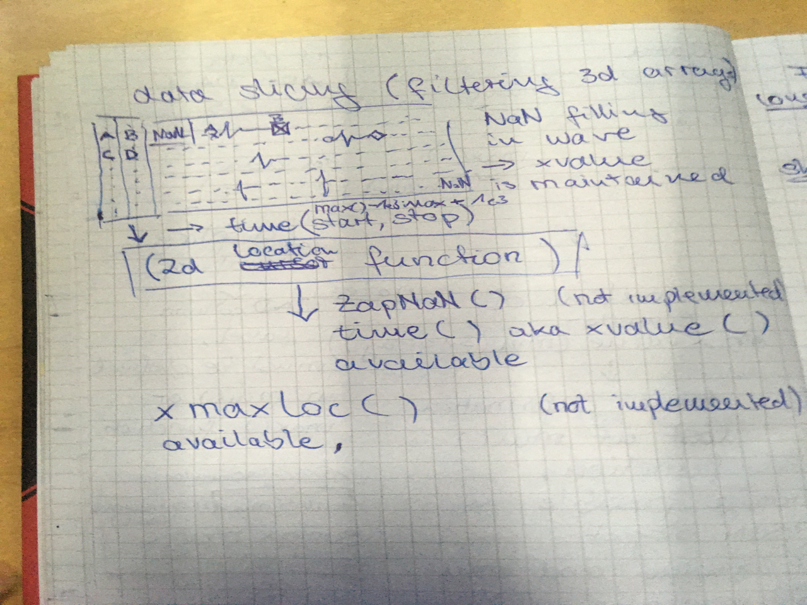

The following information is taken from annotated excerpts from the above:

- getter functions

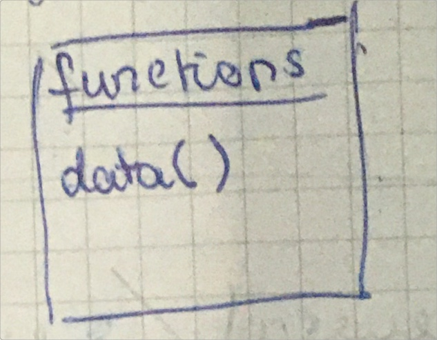

- Return data array with sweep and channel information

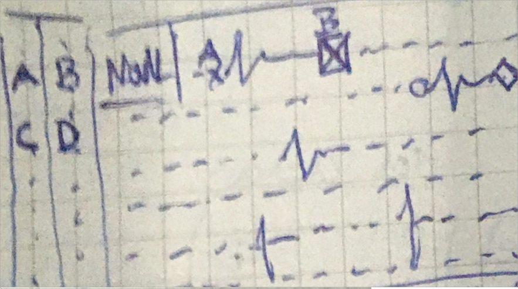

- Data slicing with 2d location functions

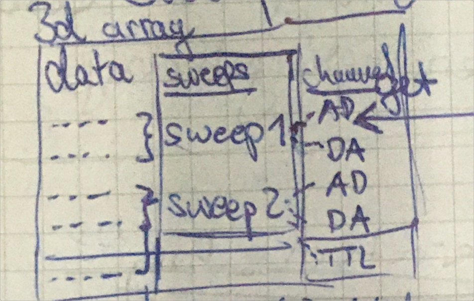

- no comment given

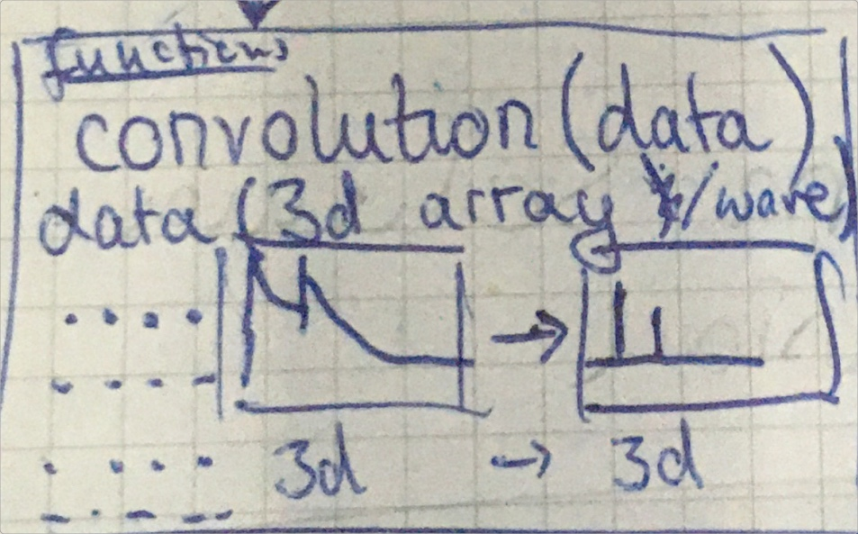

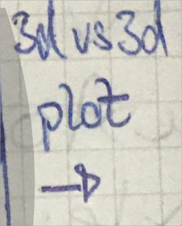

- Plot

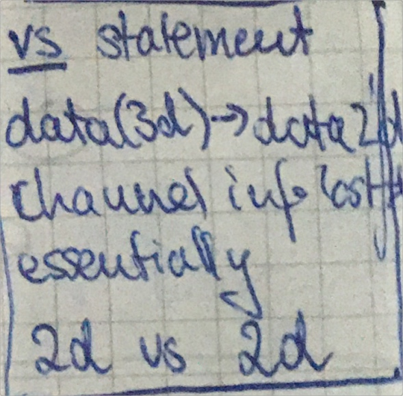

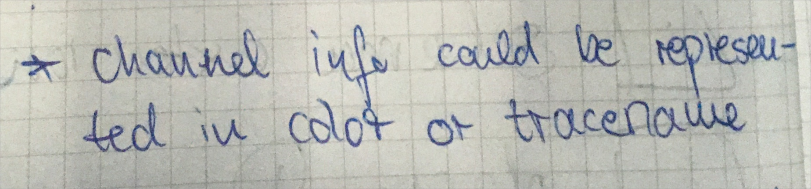

- Functions reducing a dimension of data

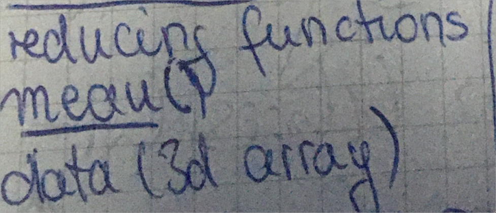

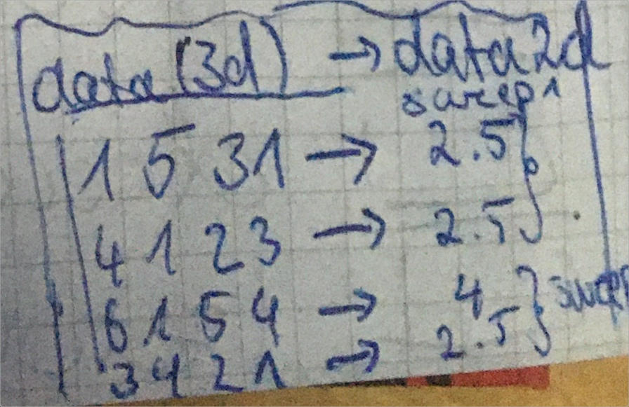

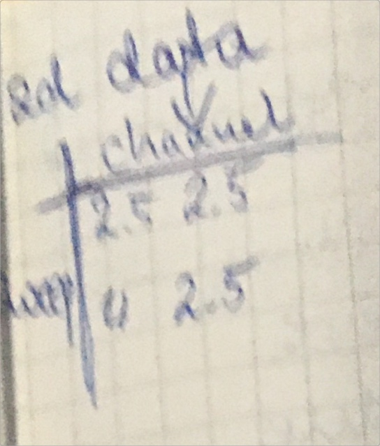

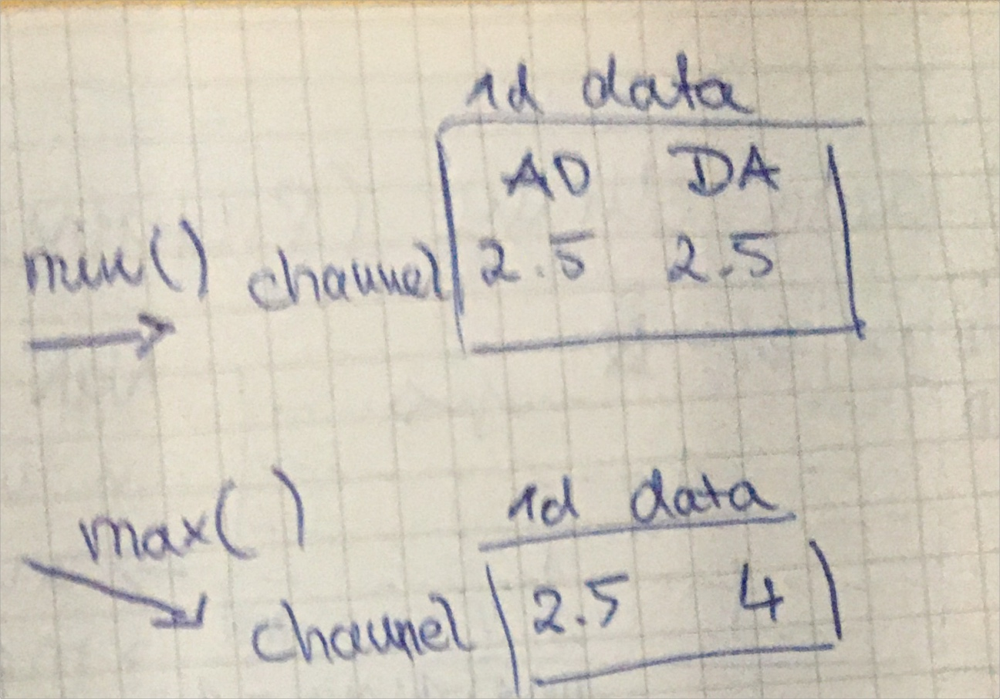

- Note on time aka xvalue concatenation logics
