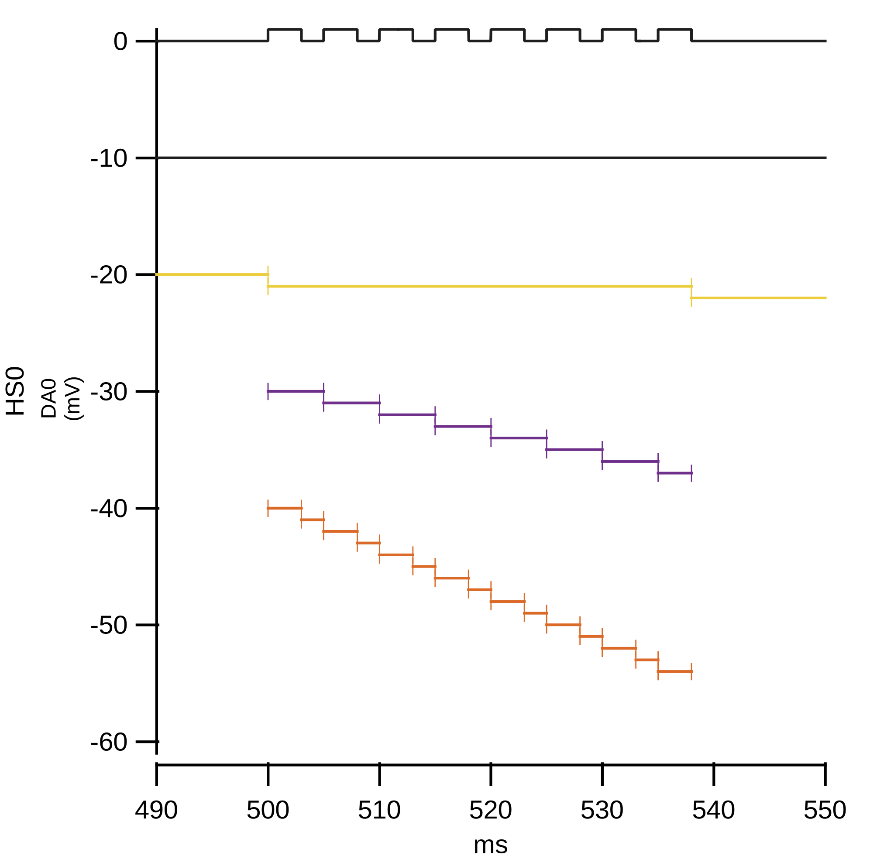

.. _epoch_information_doc:

=================
Epoch Information
=================

Description
-----------

At acquisition time, sweep epoch metadata is generated.
Epochs are contiguous time ranges in the input signal that feature certain signal shapes, such as e.g. pulse trains.
This information is exported with each data acquisition to the lab notebook with the key "Epochs" for each DA channel.

.. _Figure Epoch Visualization:

   Epoch visualization with level 0 (top, at -10) to 3 (bottom)

.. Graph recreation:
.. 1HS, Stimset: PulseTrain_200Hz, no inserted TP
.. Commands:
.. Open Databrowser
.. Enable Only DAC
.. DC_AddDebugTracesForEpochs()
.. SetAxis bottom 490,550

Retrieving Epoch Information
----------------------------

MIES labnotebook
~~~~~~~~~~~~~~~~

The epoch information can be retrieved from the lab notebook with

 .. code-block:: igorpro

    WAVE/T textualValues  = GetLBTextualValues(device)
    WAVE/T epochLBEntries = GetLastSetting(textualValues, sweepNumber, EPOCHS_ENTRY_KEY, DATA_ACQUISITION_MODE)
    WAVE/T epochHeadstage = EP_EpochStrToWave(epochLBEntries[headstage])

The epochHeadstage wave has four columns:

- Column 1: start time
- Column 2: end time
- Column 3: epoch description - a semi-colon separated list of epoch descriptors. e.g., ``Epoch=1;Type=Pulse Train;Amplitude=1;Pulse=0;``
- Column 4: (tree) level. e.g., wavebuilder defined EPOCH tree level = 1, a sub epoch of a wavebuilder defined EPOCH = 2 and so on

Each row is an epoch entry.

NWBv2
~~~~~

Epoch information is also exported into NWBv2 files into ``/intervals/epochs``
when doing full exports (it is skipped for per-sweep export). Using
`pynwb.epoch.TimeIntervals <https://pynwb.readthedocs.io/en/stable/pynwb.epoch.html#pynwb.epoch.TimeIntervals>`
this can be read with:

.. code-block:: python

    with NWBHDF5IO('file.nwb', mode='r', load_namespaces=True) as io:
        nwbfile = io.read()

        if nwbfile.epochs and len(nwbfile.epochs) > 0:
            print(nwbfile.epochs[:, 'start_time'])
            print(nwbfile.epochs[:, 'stop_time'])
            print(nwbfile.epochs[:, 'tags'])
            print(nwbfile.epochs[:, 'treelevel'])
            print(nwbfile.epochs[:, 'timeseries'])

Format
------

The times are in seconds where 0 is the beginning of the signal input. The reference signal is the DA input wave.
The epochChannel wave can contain several entries with different levels covering the same time range.
Epochs with a level of zero name the main components of the input signal.
Typical epochs with zero level are 'Inserted Test Pulse' and 'StimSet'.

A level of one designates a sub epoch of a zero level epoch and can correspond to, for example, the leading baseline a
'Inserted Test Pulse', the pulse component, and the trailing baseline of the pulse. For 'StimSet's that are level zero, the associated
Stimset-Epochs, like Ramp, Pulse Train, and so on are level one.

Accordingly level two epochs are sub epochs of level one epochs. For example, the level two epoch of a pulse train
contains a single pulse of the pulse train.

The start time of a level n epoch equals the start time of the first level n+1 epoch within the level n epochs time interval.

All epochs between 0 and end of the input signal are consecutive and without gaps (contiguous).
All level n+1 epochs are contiguous for the associated n epoch.

The following table sketches how epochs of different levels could be distributed in the range of the full output data:

+-------------------------------------------------------------------------------------------------------------------------+
|                                         output data time series range   0 - 100 [s]                                     |
+===============================================================================================+=========================+
|                              level 0: 0 - 60                                                  |level 0: 60 - 100        |
+-----------------------+-----------------------------------------------------------------------+-------------------------+
|level 1: 0 - 20        |level 1: 20 - 60                                                       |                         |
+-----------------------+-----------------+-----------------+-----------------+-----------------+-------------------------+
|                       |level 2:  20 - 30|level 2:  30 - 45|level 2:  45 - 51|level 2:  51 - 60|                         |
+-----------------------+-----------------+-----------------+-----------------+-----------------+-------------------------+

The entries in the wave are sorted by increasing start times and secondary by decreasing end times.

optimized overlap distributed data acquisistion (oodDAQ) regions
----------------------------------------------------------------

oodDAQ regions are saved as level two epoch named ``oodDAQRegion``. While regular epochs are generated from the
stimset note, oodDAQ regions are generated by the oodDAQ optimizer. Thus the oodDAQRegion epochs are not bound to the
constraints described in the previous section.
The oodDAQ regions are added 'as is' to the epochs.

Naming
------

The following table describes the 1:1 relationship between epoch names and MIES feature names:

+-------+-------+-------+-------+---------------------------------------+-------------+------------------------------------------------------------------------------+
| Level | Level | Level | Level | Name                                  | Short Name  | Origin                                                                       |
+=======+=======+=======+=======+=======================================+=============+==============================================================================+
|   0   |       |       |       | Baseline                              | B0_OD       | Onset Delay                                                                  |
+-------+-------+-------+-------+---------------------------------------+-------------+------------------------------------------------------------------------------+
|   0   |       |       |       | Baseline                              | B0_DD       | Onset delay of channel due to distributed DAQ [dDAQ]                         |
+-------+-------+-------+-------+---------------------------------------+-------------+------------------------------------------------------------------------------+
|   0   |       |       |       | Baseline                              | B0_DO       | Onset delay of channel due to distributed DAQ optimized overlay [dDAQ OptOv] |
+-------+-------+-------+-------+---------------------------------------+-------------+------------------------------------------------------------------------------+
|   0   |       |       |       | Inserted TP;Test Pulse;               | TP          | Inserted TP                                                                  |
+-------+-------+-------+-------+---------------------------------------+-------------+------------------------------------------------------------------------------+
|       |   1   |       |       | Baseline                              | TP_B0       | preceding baseline of inserted TP                                            |
+-------+-------+-------+-------+---------------------------------------+-------------+------------------------------------------------------------------------------+
|       |   1   |       |       | +pulse;Amplitude=x;                   | TP_P        | pulse time of inserted TP                                                    |
+-------+-------+-------+-------+---------------------------------------+-------------+------------------------------------------------------------------------------+
|       |   1   |       |       | Baseline                              | TP_B1       |subsequent baseline of inserted TP                                            |
+-------+-------+-------+-------+---------------------------------------+-------------+------------------------------------------------------------------------------+
|   0   |       |       |       | Stimset                               | ST          | Stimset                                                                      |
+-------+-------+-------+-------+---------------------------------------+-------------+------------------------------------------------------------------------------+
|       |   1   |       |       | Epoch=x;Type=x;Amplitude=x;Details=x; | Ex          | Stimset-Epoch                                                                |
+-------+-------+-------+-------+---------------------------------------+-------------+------------------------------------------------------------------------------+
|       |       |   2   |       | Baseline                              | Ex_PT_Px_BT | Stimset-Epoch baseline before first pulse (example pulse train)              |
+-------+-------+-------+-------+---------------------------------------+-------------+------------------------------------------------------------------------------+
|       |       |   2   |       | +Pulse=x;                             | Ex_PT_Px    | Stimset-Epoch component (example pulse train)                                |
+-------+-------+-------+-------+---------------------------------------+-------------+------------------------------------------------------------------------------+
|       |       |       |   3   | +Active                               | Ex_PT_Px_P  | High region of pulse  (example pulse train)                                  |
+-------+-------+-------+-------+---------------------------------------+-------------+------------------------------------------------------------------------------+
|       |       |       |   3   | +Baseline                             | Ex_PT_Px_B  | Zero region of pulse  (example pulse train)                                  |
+-------+-------+-------+-------+---------------------------------------+-------------+------------------------------------------------------------------------------+
|       |       |   2   |       | oodDAQRegion=x                        | ODx         | oodDAQ region                                                                |
+-------+-------+-------+-------+---------------------------------------+-------------+------------------------------------------------------------------------------+
|       |   1   |       |       | Baseline                              | ST_B        | trailing baseline due to different length stimsets                           |
+-------+-------+-------+-------+---------------------------------------+-------------+------------------------------------------------------------------------------+
|   0   |       |       |       | Baseline                              | B0_TR       | trailing baseline from Distributed DAQ [OptOv]                               |
+-------+-------+-------+-------+---------------------------------------+-------------+------------------------------------------------------------------------------+
|   0   |       |       |       | Baseline                              | B0_TD       | Termination Delay                                                            |
+-------+-------+-------+-------+---------------------------------------+-------------+------------------------------------------------------------------------------+
|   0   |       |       |       | Unacquired                            | UA          | Planned to be acquired but skipped due to early sweep stop                   |
+-------+-------+-------+-------+---------------------------------------+--------------------------------------------------------------------------------------------+

If the name entry begins with '+' then it is appended to the higher-level name. The 'x' is a place holder where
additional information is included in the names, such as Stimset-Epoch numbering, or amplitudes. Currently only pulse
trains (see below) are supported with level two and three detail for Stimset-Epochs. Depending on the setup of the data
acquisition, not every entry listed in the table has to appear in the epochs table.

The 'Details' key for the Stimset-Epoch can contain a combination of 'Mixed frequency' or 'Poisson distribution' with
'shuffled' as originally configured for the Stimset in the waveBuilder.

When the sweep is terminated earlier as planned, the epoch ``Unacquired`` is added in the planned but not acquired
timespan at the end of the sweep. All other epochs are then also either shortend or dropped so that they don't extend
into the unacquired epoch.

Short Names
~~~~~~~~~~~

In addition to the long names that are generated as described above also unique short names are created. These short names are saved
in the epoch description field as well as key value pair. The key is ``ShortName`` and the separator ``=``. To retrieve a short name
the function ``EP_GetShortName(string name)`` should be used.

Short names are created in the form of blocks of one to two uppercase letters followed optionally by a signed integer number.
Subsequent blocks are separated by an underscore. Example: ``E0_PT_P48_B``.

Pulse Trains
------------

Pulse Trains are a type of Stimset-Epochs which is widely used and covered in high detail in the epochs table. For pulse
trains each pulse gets an level two epoch entry. The time interval of a pulse begins when the signal is above base line
level and includes the trailing baseline (that precedes the next pulse) unless it is the last pulse in the pulse train.
An epoch named 'Baseline' is inserted if the first pulse in the pulse train has a leading baseline. This is applies for
flipped Stimsets containing Stimset-Epochs with type pulse train.

.. _user_epochs_doc:

User epochs
-----------

Adding custom epoch information is supported via :cpp:func:`EP_AddUserEpoch`. This is especially useful for analysis
function writers, who can add their own epochs of interest, see :ref:`File MIES_AnalysisFunctions.ipf` for the
supported events.

The ``tags`` property of user epochs can be freely set. When a ``shortName`` is supplied, this is always prefixed with
``U_`` so that short names for user epochs don't collide with builtin epochs. Likewise the tree level for user epochs is
fixed to ``-1``.

User epochs will also be limited to the acquired sweep data like builtin epochs. This can result in shorter as expected epochs or even
removed user epochs.

 .. code-block:: igorpro
   :caption: Example

    string device = "ITC18USB_DEV_0"
    variable startTime = 1.5
    variable endTime   = 2.5
    variable DAC = 1
    string tags = "Name=Found Spikes;"
    string shortName = "FS"

    EP_AddUserEpoch(device, XOP_CHANNEL_TYPE_DAC, DAC, startTime, endTime, tags, shortName = shortName)
