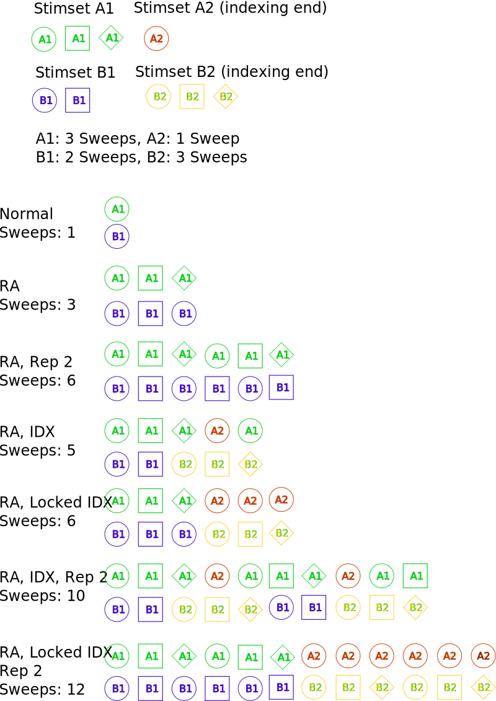
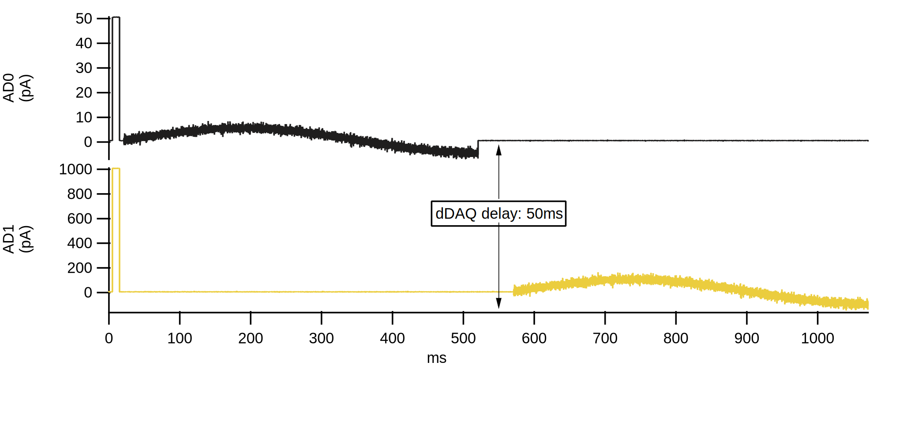
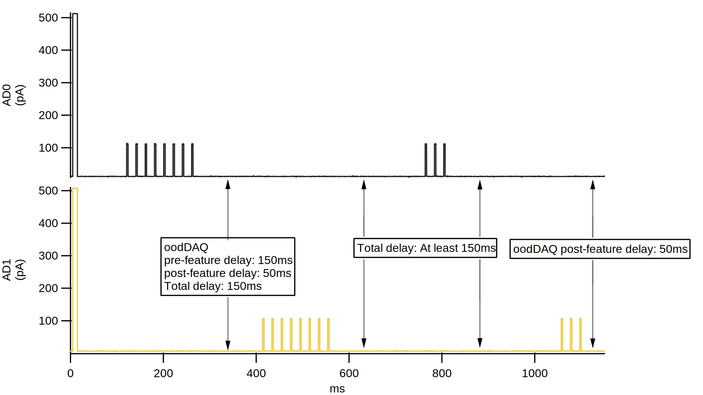

Table of Contents
=================

.. toctree::
  :maxdepth: 1

  developers
  manualinstallation
  reportingbugs
  releasenotes
  grouplist
  filelist
  structlist
  namespacelist
  CalculateTPLikePropsFromSweep
  IPNWB
  TPAnalysis_algorithm
  asyncframework
  ZeroMQ-XOP-Readme
  labnotebook-docs
  epoch_information
  mies-concepts

Introduction
============

MIES is sweep based data acquisition tool written in Igor Pro.

MIES has three primary user interfaces: The waveBuilder, DA_Ephys, and
dataBrowser. The waveBuilder is used to generate stimulus sets. The DA_Ephys
GUI is used to control and observe data acquisition in real time.  The
DataBrowser is used to browse acquired data. All three interfaces are intended
to be operated in parallel.

The Wavebuilder is used to create a series of related sweeps called a stimulus
set. A sweep is composed of up to 99 epochs. Each epoch can contain one of
seven different waveforms types, arbitrary combinations of waveform types, or a
custom waveform. A custom waveform can be a sweep from a different stimulus
set, or a waveform generated by the user using other tools. Custom code to
automate analysis or data acquisition, executed during acquisition, can be
associated with a stimulus set as well.

GUI control of data acquisition is achieved using the DA_Ephys panel. For
example, the user can assign a stimulus set to a digital to analog (DA)
channel. The DA_Epys panel centralizes control of multiple hardware components
necessary for performing electrophysiology experiments, including the DAC,
amplifier, and pressure regulators.

The MIES DataBrowser allows the user to view acquired sweeps and metadata
during and after an experiment. It has several display modes that facilitate
recording from multiple channels simultaneously.

MIES is scalable: MIES can control up to 5 DACs (Instrutech/Heka and National
Instruments), multiple amplifiers (Molecular Devices 700B), and pressure
regulators (Proportion Air).

It is possible to control MIES remotely with `ZeroMQ
<https://alleninstitute.github.io/MIES/ZeroMQ-XOP-Readme.html>`__. Data may be
analyzed with Igor Pro or with other tools using `NeurodataWithoutBorders (NWB)
<https://www.nwb.org>`__ files generated by MIES.

MIES has two primary modes: The Test Pulse (TP) and Data Acquisition.

   Data acquisition modes

.. figure:: normal-delays.svg
   :align: center

   Normal delays

   Ddaq delay

   oodDAQ delays

.. figure:: testPulse-visualization.svg
   :align: center

   Testpulse visualization

Indexing definition
-------------------

In MIES we have different modes in which a given stimset or multiple stimsets
can be repeated.  The following is a human readable, and authorative
description, how these modes work.

Indexing is a mode which allows to acquire a range of stimsets across mutiple
channels and channel types (DA and TTL).

As these stimsets can have a different number of sweeps the natural question
arises when to switch to the next stimset. Locked indexing switches stimsets
when the stimset with the most sweeps (currently acquiring, not globally) on
all active channels is finished. Unlocked indexing switches stimset on each
channel independently. In both modes the currently active stimset is repeated
in one channel if there is some space left.

With repetitions larger than 1 the difference is even more pronounced as locked
indexing first repeats and then indexes and unlocked indexing indexes and then
repeats.

Inner-Set randomization is currently broken with indexing.
Set randomization with indexing is not implemented.
