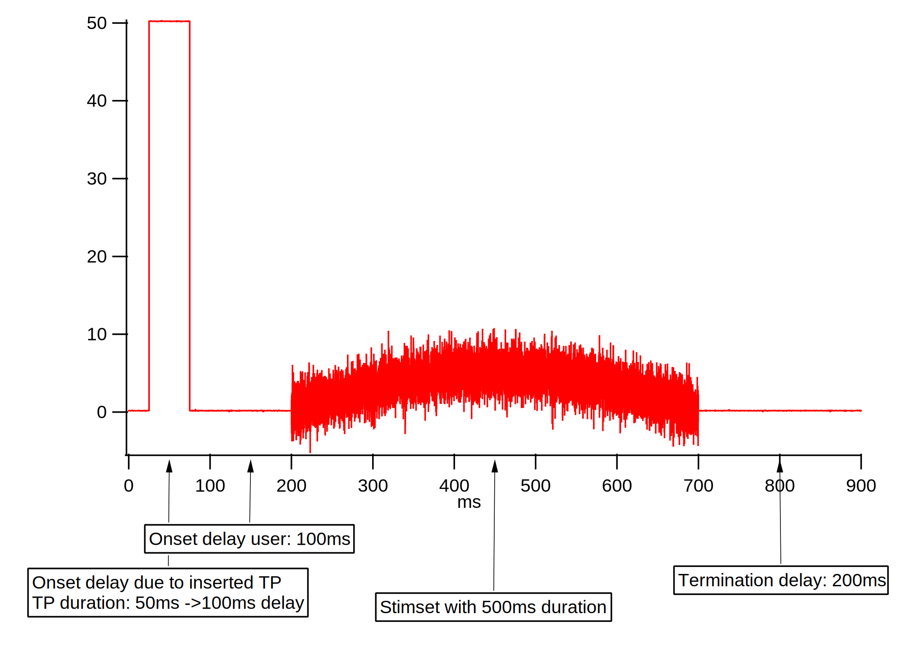
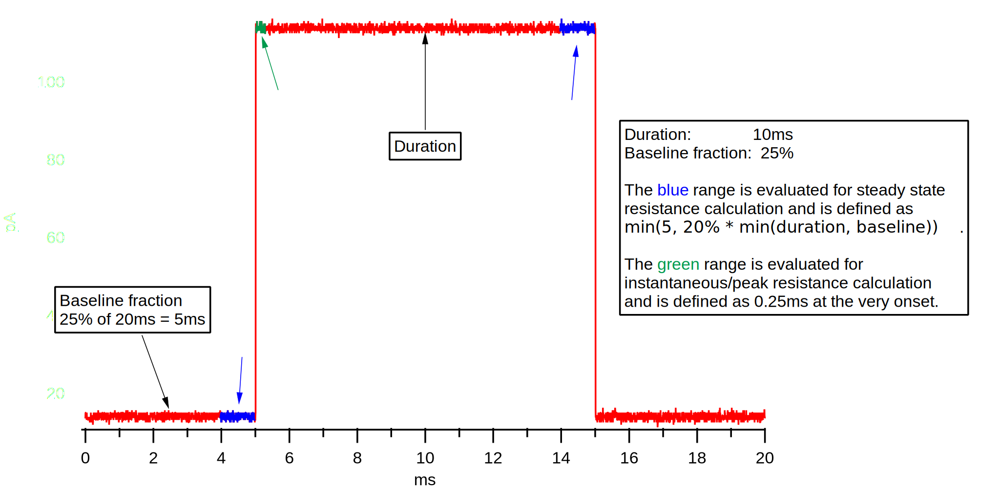

Table of Contents
=================

.. toctree::
  :maxdepth: 1

  developers
  manualinstallation
  reportingbugs
  releasenotes
  grouplist
  filelist
  structlist
  namespacelist
  CalculateTPLikePropsFromSweep
  IPNWB
  TPAnalysis_algorithm
  asyncframework
  ZeroMQ-XOP-Readme
  labnotebook-docs
  mies-concepts

Introduction
============

MIES is sweep based data acquisition code written in Igor Pro from
WaveMetrics.

Presently, MIES is composed of 3 primary GUIs: The Wavebuilder,
DA\_Ephys, and DataBrowser. The Wavebuilder is used to generate stimulus
sets. The DA\_Ephys GUI is used to operate HEKA/Instrutech digital to
analog converters (DAC). The DA\_Ephys panel uses the stimulus sets
generated by the Wavebuilder to control the output of the DAC. The
DataBrowser is used to browse data acquired, or that will be acquired,
using the DA\_Ephys panel.

The Wavebuilder is used to create stimulus sets. A stimulus set is a
series of related sweeps. A sweep is composed of up to 99 epochs. Each
epoch can contain one of seven different waveforms or a custom waveform.
A custom waveform can be a sweep from a different stimulus set, or a
waveform generated by the user using alternate tools. The main
limitation of the Wavebuilder is that each epoch must have the same
number of sweeps/steps.

The DA\_Ephys allows the user to determine on which digital to analog
(DA) channel to output a stimulus set. The DA\_Epys panels has
additional features that make it amenable to performing
electrophysiology experiments. These features are organized around the
concept of a *headstage*. In hardware, a headstage contains the first
amplification stage of amplifiers used in electrophysiology recordings.
MIES's software representation of the headstage is the association of
the amplifier used to obtain the recording, and the channels on DAC used
send and receive signals from the amplifier. MIES also associates other
hardware with the headstage. These (will) include the amplifier
controls, micromanipulators (used to position the recording electrode on
the neuron), and analog pressure regulators (used to automate pressure
control of the recording pipette).

The MIES DataBrowser (will) allow the user to look forward and back in
time, that is, it allows the user to view the sweeps MIES will output,
as well as the sweeps MIES did output, and their response.

MIES is designed to be scalable: MIES can control up to 10 (only 4 have
been tested) HEKA/Instrutech DACs independently or
synchronously(ITC1600).

MIES has two primary modes: The Test Pulse (TP) and Data Acquisition.

.. figure:: acquisition-repeated-indexing-explained.svg
   :align: center

   Data acquisition modes

   Normal delays

.. figure:: ddaq-delay.svg
   :align: center

   Ddaq delay

.. figure:: oodDAQ-delays.svg
   :align: center

   oodDAQ delays

   Testpulse visualization

Indexing definition
-------------------

In MIES we have different modes in which a given stimset or multiple stimsets
can be repeated.  The following is a human readable, and authorative
description, how these modes work.

Indexing is a mode which allows to acquire a range of stimsets across mutiple
channels and channel types (DA and TTL).

As these stimsets can have a different number of sweeps the natural question
arises when to switch to the next stimset. Locked indexing switches stimsets
when the stimset with the most sweeps (currently acquiring, not globally) on
all active channels is finished. Unlocked indexing switches stimset on each
channel independently. In both modes the currently active stimset is repeated
in one channel if there is some space left.

With repetitions larger than 1 the difference is even more pronounced as locked
indexing first repeats and then indexes and unlocked indexing indexes and then
repeats.

Inner-Set randomization is currently broken with indexing.
Set randomization with indexing is not implemented.
