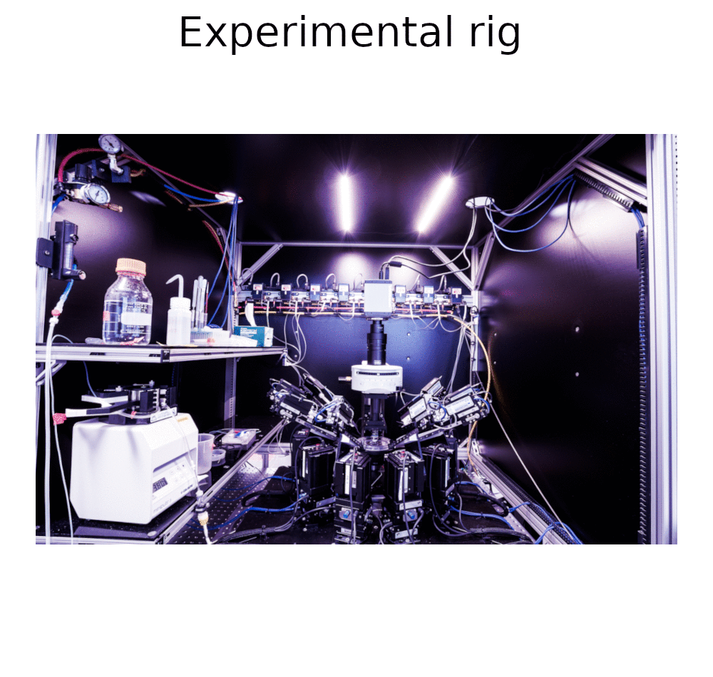

MIES is a proven \[[1](https://doi.org/10.1038/s41593-019-0417-0),
[2](https://elifesciences.org/articles/37349)\] sweep based data acquisition
software package for intracellular electrophysiology (patch clamp). It offers
top of its class flexibility and robustness for stimulus generation, data
acquisition, and analysis.

## Highlights

- Acquire data on up to eight headstage on a single DAC.
- Run up to five DACs in parallel.
- Create arbitrarily complex stimulus sets with an easy to use GUI
- Export all data, including all of its metadata, into the industry-standard NWBv2-format and read it back in
- Run custom code during data acquisition for Automatic Experiment Control
- Completely automate the experimental setup using JSON configuration files
- Interact with MIES from other programming languages (Python, C++, Javascript, ...) using ZeroMQ.
- Comprehensive experimental metadata acquisition and browsing tools
- Use the integrated scripting language for convenient on-the-fly data evaluation.
- Fully backward compatible with every earlier MIES version

## Supported Hardware

- National Instruments:
  * [PCIe-6341](https://www.ni.com/de-de/support/model.pcie-6341.html)
  * [PCIe-6343](https://www.ni.com/en-us/support/model.pcie-6343.html)
  * [PXI-6259](https://www.ni.com/en-us/support/model.pxi-6259.html)

- Instrutech/HEKA ITC:
  * [16](http://www.heka.com/downloads/hardware/manual/itc16.pdf)
  * [18](http://www.heka.com/downloads/hardware/manual/m_itc18.pdf)
  * [1600](http://www.heka.com/downloads/hardware/manual/m_itc1600.pdf)

  ITC devices are at the End-Of-Service-Life (EOSL). National Instruments DACs are recommended for MIES users looking
  for new hardware.

- Amplifier: Molecular Devices [700B](https://www.moleculardevices.com/products/axon-patch-clamp-system/amplifiers/axon-instruments-patch-clamp-amplifiers)
- Pressure control (optional): ITC 18/1600 or National Instruments [USB 6001](https://www.ni.com/en-us/support/model.usb-6001.html)

## Required Software

- Windows 10 x64
- [Igor Pro 8.04 (nightly) or later](https://www.wavemetrics.com/)
- [NIDAQ MX XOP](https://www.wavemetrics.com/products/nidaqtools/nidaqtools.htm)

## Getting started

- [Download](https://github.com/AllenInstitute/MIES/releases/tag/latest) the latest release
- Run the installer
- [View](https://alleninstitute.github.io/MIES/user.html) the documentation

## Support statement

The last released version receives fixes for all critical bugs.

## Bug reporting

[Instructions](https://alleninstitute.github.io/MIES/reportingbugs.html)
